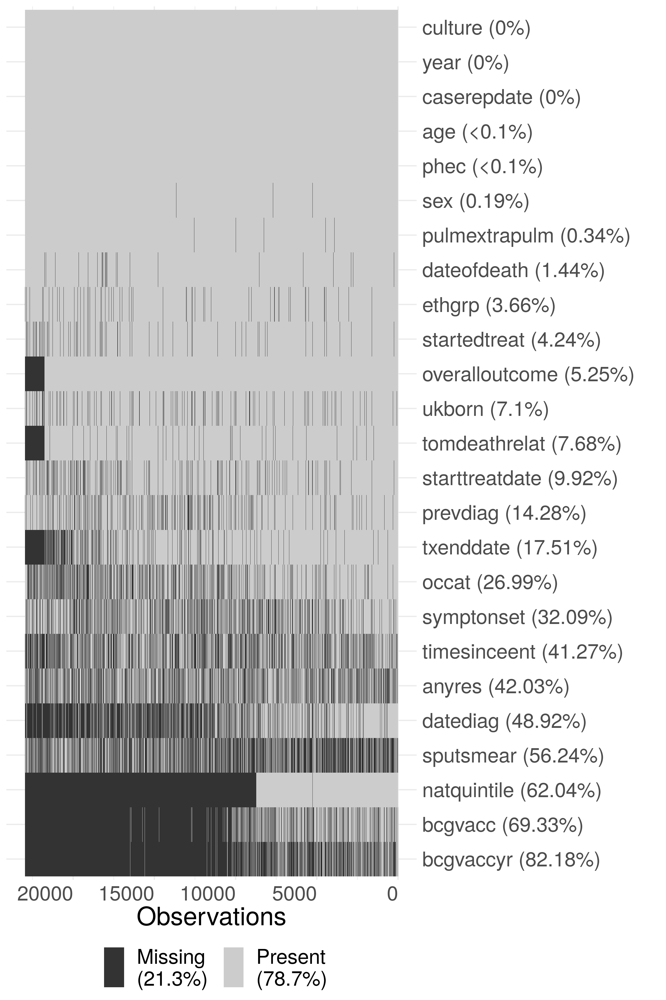
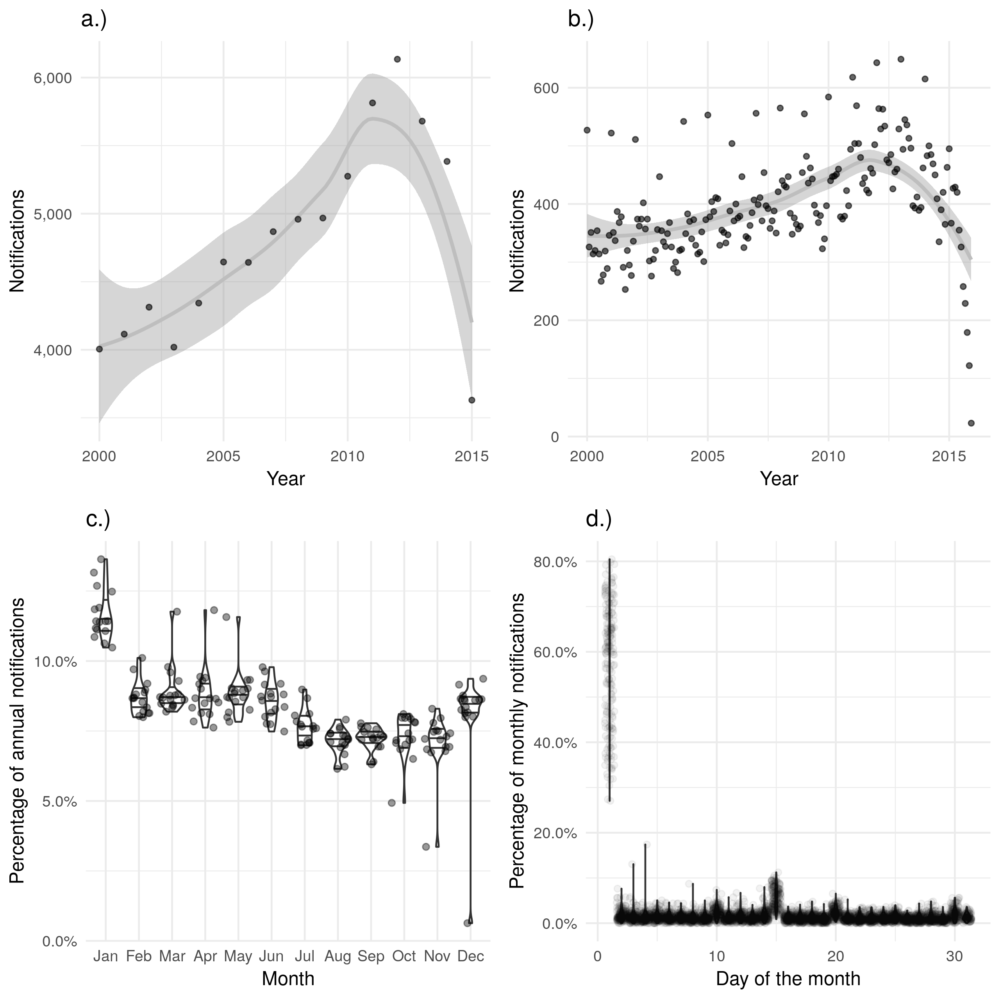
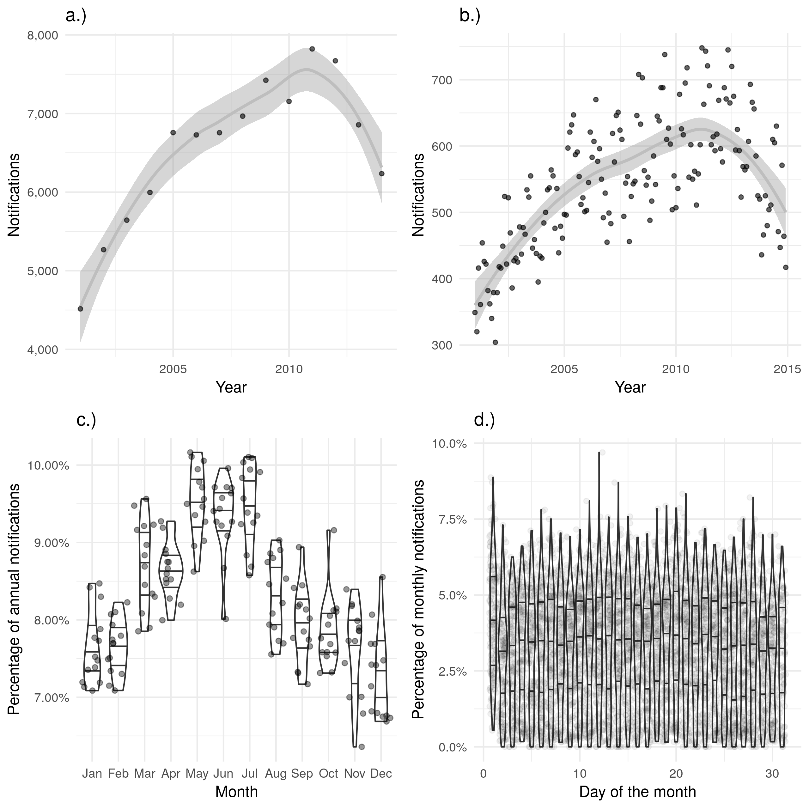
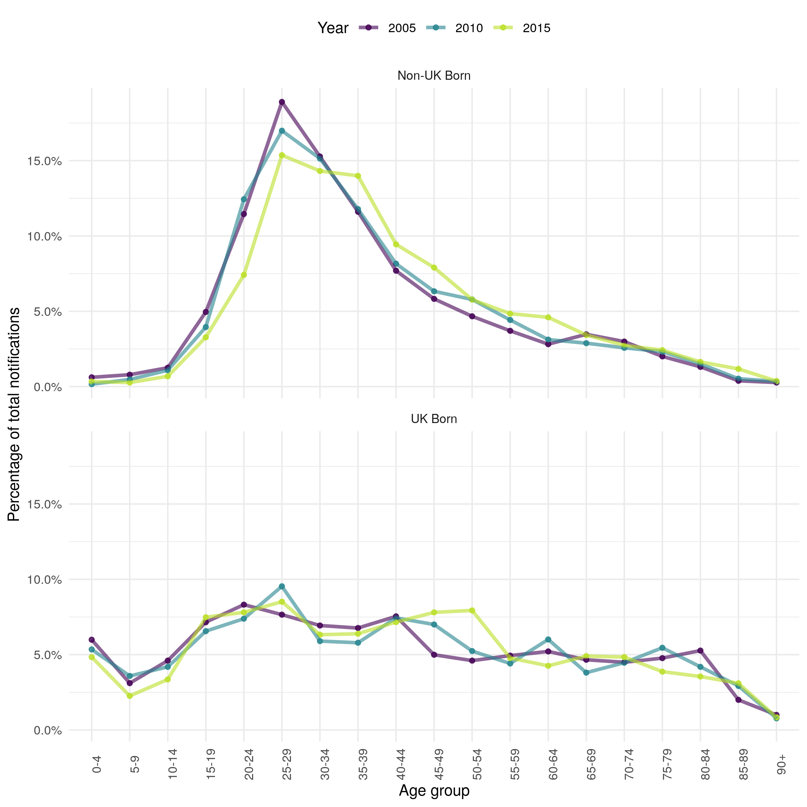
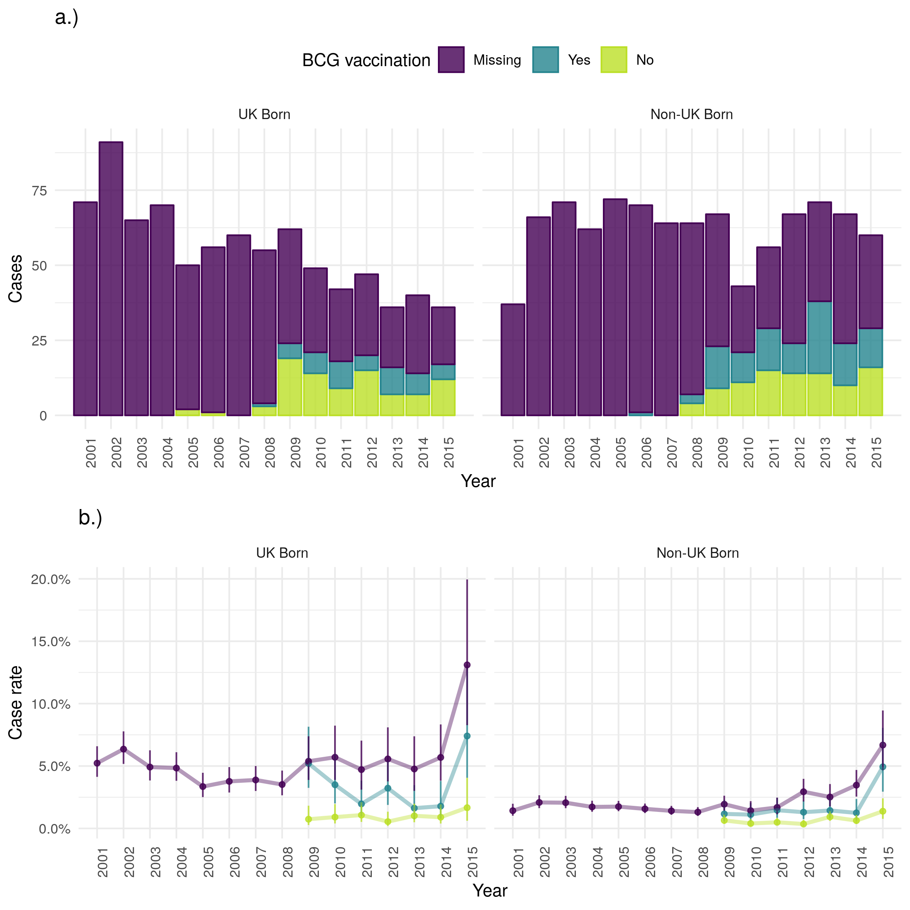
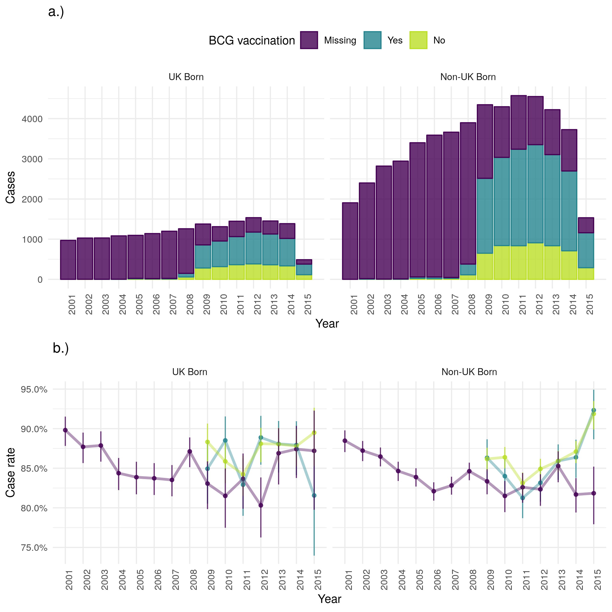
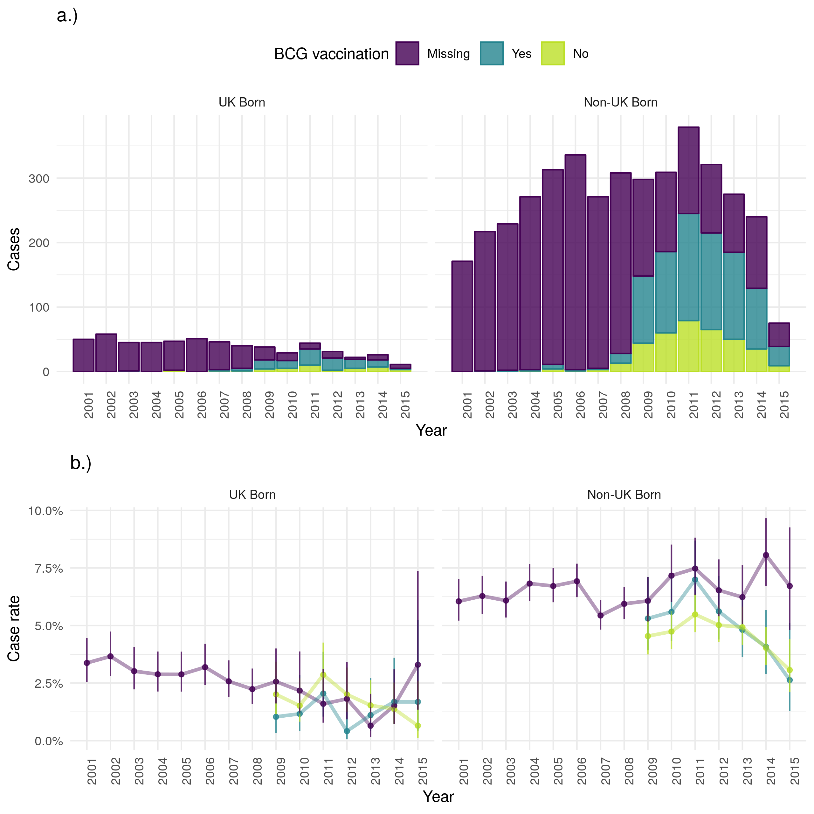
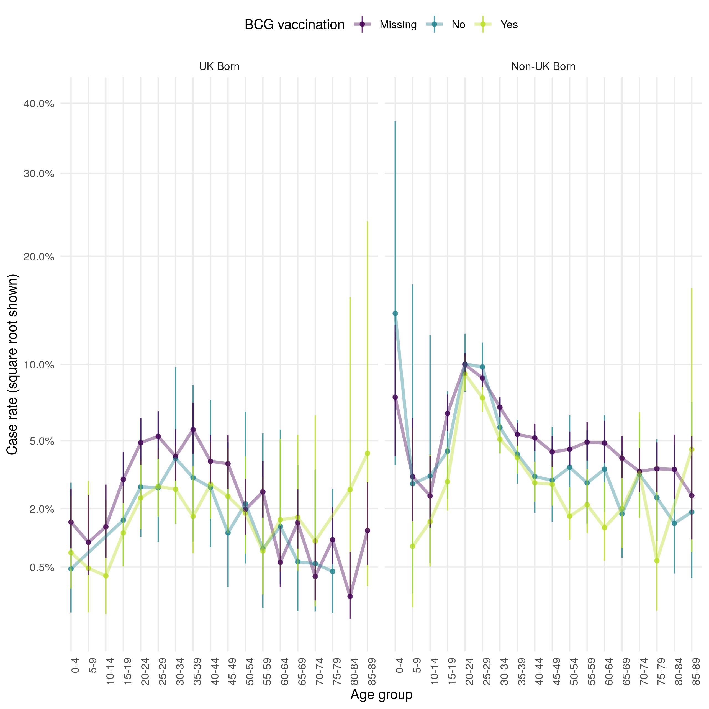

---
output:
  pdf_document: default
---
# The epidemiology of tuberculosis, and the role of BCG vaccination, in England {#data}

```{r tb-epi-setup, include=FALSE}
regen_results <- FALSE
knitr::opts_chunk$set(echo = FALSE, warnings = FALSE,
                      fig.width = 8, fig.height = 8,
                      out.width = "80%", fig.align = 'center')
##Wordcount: 8497
```

```{r analysis-packages, include=FALSE}
library(tidyverse)
library(lubridate)
library(gridExtra)
library(knitr)
library(kableExtra)
library(pander)
library(visdat)
library(naniar)
library(haven)
library(epiR)
library(scales)
library(broom)
library(pomp)
library(stringr)
library(tbinenglanddataclean)
library(prettypublisher)

PaperTheme <- theme_minimal() +
  theme(legend.position = "top")
```

## Introduction

Whilst the characteristics of tuberculosis in England have been reported elsewhere,[@PHE2017; @PHE2018] and key risk factors such as non-UK birth status have been identified,@French2007 little attention has been given to the role of BCG vaccination. In particular, there is little information available regarding the demographics of vaccinated versus unvaccinated cases and the impact of BCG vaccination on TB outcomes in England has not been explored. There has also only been limited reporting of the age distribution, and trends over time, in incidence rates stratified by UK birth status.


In this chapter I explore the epidemiology of TB in England using routine data-sets, with a particular focus on the impact of missing data, the mechanisms underlying that missing date, seasonal trends, the role of age, UK birth status and BCG status. I have also estimated incidence rates, stratified by UK birth status and age, which I then used to identify trends in TB incidence over time. Finally I report TB outcomes in England using case rates, again stratified by BCG status and UK birth status. These data will then be used throughout this thesis to explore the impact of BCG vaccination on TB outcomes (Chapter \@ref(benefical-bcg-out)), to estimate the direct impact of the 2005 change in BCG vaccination policy (Chapter \@ref(direct-eff)), to parameterise a dynamic TB transmission model (Chapter \@ref(model-development)) and to fit the same model to data (Chapter \@ref(model-fit)).

## Data sources

### Enhanced tuberculosis surveillance system {#ets-deep-dive}

```{r load-ets, messages = FALSE}
if (regen_results) {
  ets <- readRDS("../data/tbinenglanddataclean/clean_ets_2016.rds")

}
```

#### Background

The enhanced tuberculosis surveillance system (ETS) is maintained by Public Health England (PHE) and collects demographic, clinical, and microbiological data on all notified cases in England. Notification is required by law, with health service providers having to inform PHE of all confirmed TB cases.[@PHE2017] Data collection began in 2000 and was expanded, with additional variables, with the launch of a web based system in 2008.[@Kriujshaar2007] It is updated annually with de-notifications, late notifications and other updates. A descriptive analysis of tuberculosis epidemiology in England is published each year, which reports on data collection, cleaning, and trends in TB incidence at both a national, and sub-national level.[@PHE2017]

#### Data extraction and management

Data on all notifications from the Enhanced Tuberculosis Surveillance (ETS) system from 2000 to 2015 were obtained from PHE. Data fields included: notification date, age, Public Health England centre, occupation, ethnic group, UK birth status, years since entry to the UK, date of symptom onset, date of presentation, date of diagnosis, date of treatment start, date of treatment end, date of death, Pulmonary TB status, culture status, sputum smear status, drug resistance, BCG vaccination status, year of vaccination, outcome at 12 months, overall outcome, and cause of death. Invalid entries were replaced with missing values unless otherwise noted, with character variables stored as factors using their most common entry as the baseline. Notifications from Scotland, Northern Ireland and Wales were dropped from the data-set. Several variables were created, or modified, for use in further analysis, Table \@ref(tab:created-var) summarises these variables. The code used for data cleaning is available as an R package ([https://www.samabbott.co.uk/tbinenglanddataclean/reference/clean_munge_ets_2016.html](https://www.samabbott.co.uk/tbinenglanddataclean/reference/clean_munge_ets_2016.html)).


```{r created-var}
created_var <- tibble(
  `Created/modified variable` = c('Years since BCG', 
                                  'Age at BCG', 
                                  'Successful treatment',
                                  'Mortality', 
                                  'TB mortality',
                                  'Death due to TB'),
  Description = c('Derived using year of vaccination and year of notification. Categorised into $\\leq 10$ and 11+ due to the evidence of waning protection for the BCG vaccine.[@Abubakar2013]', 
                  'Derived using year of vaccination and age at vaccination. Categorised into < 1, 1 to x < 12, 12 to x < 16 and $\\leq 16$ to capture historic vaccination policy.[@PublicHealthEngland2011a]', 
                  'For cases that had a recorded date of starting treatment, with their outcome recorded at the latest available follow up. Those that completed treatment are defined as successfully treated; treatment failure is defined as those that stopped treatment, were lost to follow up, those that died during follow up from TB, those that died during follow up were TB contributed to their death, and those who were still on treatment. Those that were not evaluated were treated as missing.', 
                  'Assessed via follow up at 12 and 24 months; mortality is defined as cases with an overall outcome of died, and survival is defined as those that completed treatment, were still on treatment, and stopped treatment. Those that were lost to follow up, or not evaluated were treated as missing', 
                  'For cases with an overall outcome of died, and whose cause of death was known to be TB or to be related to TB. Those that were known to have not died, or who were known to have died from a cause other than from TB were defined to have not died from TB.',
                  'Death due to TB is defined as those that died directly from TB, or where TB had contributed to their death with death not due to TB being cases that died from any other cause. Conditioned on all-cause mortality, for cases with a known cause of death.')
  
)

pander::pander(created_var, caption = '(\\#tab:created-var) Variables derived or modified from the Enhanced Tuberculosis Surveillance system for use in the analyses throughout this thesis.', booktabs = TRUE, justify = 'left', split.cells = 50)
```


#### Structure of the ETS

The ETS is in a wide format with each notification having a single row, and with each unique variable having a single column. This structure means that the progression of tuberculosis in each individual is captured by a series of dates rather than as a series of events. As notifications are not linked to a unique patient I.D it is possible that individuals are duplicated within the ETS, with multiple notifications. These recurrent notifications have been flagged within the data extract by the TB section at PHE. The majority of variables are factors, with a significant minority of numeric and date variables. 

```{r data-struct, fig.cap = "Summary plot of the structure of the Enhanced Tuberculosis Surveillance data extract used in this thesis. Due to the large size of the dataset, the data has been sub sampled with only 20\\% of the data shown. Notifications have been ordered by date of notification from left to right. Purple indicates numeric variables, green indicates factor variables, dates are shown using red and samples with missing values are shown using grey. The figure shows that the majority of the included variables are factors, with a significant minority of numeric and date variables. Data completeness is near random for some variables but has changed other time for others, for example national socioeconomic quintile (natquintile). This figure does not account for nested variables", out.width = "60%", eval = FALSE}
if (regen_results) {
  plot_data_struct <- ets %>% 
    sample_frac(0.2) %>% 
    arrange(desc(caserepdate)) %>% 
  vis_dat(warn_large_data = FALSE) + 
    coord_flip() +
    theme(legend.position = "bottom")
  
  ggsave("chapters/tb-epi-england/figures/plot-data-struct.png", plot_data_struct, dpi = 320, width = 8, height = 12)
}

#Figure \@ref(fig:data-struct) provides an overview of the structure of the ETS extract.
knitr::include_graphics("chapters/tb-epi-england/figures/plot-data-struct.png")
```

#### Data completeness

```{r miss-dat-munge, include = FALSE}
if (regen_results) {
  source("chapters/tb-epi-england/R/scripts/nested-missing-data.R")
}else{
  miss_ets_pre_2009 <- readRDS("chapters/tb-epi-england/data/miss_ets_pre_2009.rds")
  miss_ets_post_2008  <- readRDS("chapters/tb-epi-england/data/miss_ets_post_2008.rds")
  missing_stats <- readRDS("chapters/tb-epi-england/data/missing_stats.rds")
}
```

Missing data can take several forms, data that is missing completely at random (MCAR), data that is missing at random (MAR) and data that is missing not at random (MNAR).@Sterne2009a Data that is MAR is missing with a mechanism that is conditional on observed variables, whilst MNAR is missing with a mechanism that is conditional on variables that are not observed. Data that is MAR, and MNAR may lead to biases when analysing the data, however it is not possible to deduce from the observed data what the mechanism driving missing data is. Therefore, it is necessary to account for these potential biases during the analysis stage. This is possible using a variety of methods such as scenario analysis accounting for the 'best' and 'worst' case scenario's, and multiple imputation of missing data using additional variables in the data set to inform the imputation model.@Sterne2009a

As the ETS is aggregated across England, from a variety of sources, some level of missing data is inevitable. This takes two forms; under-reporting of notified cases, of which there is some evidence in the literature,[@Pillaye2003] and data missing for a notified case. The former is particularly problematic as apart from using comparative studies the structure of those that are not notified is unknown. For variables that are missing data within the data-set it is possible to calculate the proportion of missing data (Figure \@ref(fig:plot-missing-struct), Table \@ref(tab:missing-var-tabs)) but care must be taken to account for nested variables such as date of death and year of BCG vaccination. This can be done by assuming the value for the top level variable when it is known that the variable is not truly missing. An example of this is using overall outcome for data of death when notifications are known to have not died.  Doing this shows high completeness for common demographic variables such as sex, age, ethnic group and UK birth status. More problematically, BCG status and year of BCG status have a high percentage missing, even after accounting for the introduction of national collection of these variables in 2008. Socio-economic status (as national quintiles) was not collected until 2010 but after this point is highly complete.  Comparing pre 2009 and post 2008 in Table \@ref(tab:missing-var-tabs) (and by inspecting Figure \@ref(fig:plot-missing-struct)) there are also issues of changing completeness over time,[@PHE2016; @PHE2017] if this is not accounted for than it may lead to spurious trends. Figure \@ref(fig:plot-missing-struct) also indicates that there are multiple groups of variables that share a common pattern of missing data.

```{r plot-missing-struct, fig.cap = "Summary plot of missing data in the extract of the Enhanced Tuberculosis Surveillance data used in this thesis. Due to the large size of the dataset, the data has been sub-sampled with only 20\\% of the data shown in this figure. Notifications have been ordered by date of notification from left to right. The following subset of variables are shown; year (year), sex (sex), age (age), Public Health England Centre (phec), Occupation (occat), Ethnic group (ethgrp), UK birth status (ukborn), Time since entry (timesinceent), date of symptom onset (symptonset), date of diagnosis (datediag), started treatment (startedtreat), date of starting treatment (starttreatdate), treatment end date (txenddate), pulmonary or extra-pulmonary TB (pulmextrapulm), culture (culture), sputum smear status (sputsmear), drug resistance (anyres), previous diagnosis (prevdiag), BCG status(bcgvacc), Year of BCG vaccination (bcgvaccyr), overall outcome (overalloutcome), cause of death (tomdeathrelate), socio-economic status quintiles (natquintile), and date of death (dateofdeath). Nested variables have been accounted for (i.e data of death has had an entry added for cases that are known to have not died), so that true missingness for all variables is estimated.", out.width = "60%"}

```


```{r missing-var-tabs}
miss_ets <- miss_ets_pre_2009 %>% 
  left_join(miss_ets_post_2008, by = "Variable")

colnames(miss_ets) <- c("Variable", 
                        rep(c("Missing (N)"," Missing (%)"), 2))
  
kable(miss_ets,
      caption = "Breakdown of missing data from the ETS prior to the web based system (pre 2009) and post (post 2008) by variable, ordered by the  percentage missing for a subset of variables. The following subset of variables are shown; year (year), sex (sex), age (age), Public Health England Centre (phec), Occupation (occat), Ethnic group (ethgrp), UK birth status (ukborn), Time since entry (timesinceent), date of symptom onset (symptonset), date of diagnosis (datediag), started treatment (startedtreat), date of starting treatment (starttreatdate), treatment end date (txenddate), pulmonary or extra-pulmonary TB (pulmextrapulm), culture (culture), sputum smear status (sputsmear), drug resistance (anyres), previous diagnosis (prevdiag), BCG status(bcgvacc), Year of BCG vaccination (bcgvaccyr), overall outcome (overalloutcome), cause of death (tomdeathrelate), socio-economic status quintiles (natquintile), and date of death (dateofdeath). Nested variables have been accounted for (i.e data of death has had an entry added for cases that are known to have not died), so that true missingness for all variables is estimated.",
      booktabs = TRUE) %>%
  add_header_above(c(" ", "Pre 2009" = 2, "Post 2008" = 2)) %>% 
  kable_styling(latex_options = "HOLD_position") 
```

For nested variables, with rare outcomes, assuming the top level variable value can mask the underlying amount of missing data. An alternative approach is to filter the data for the top level variable required for the nested variable to be defined and to then compute the proportion of these notifications that are missing the data for the outcome of interest. For the date of starting treatment this approach leads to an estimate of `r missing_stats[["date_treat"]]` being missing, which is more complete than previously estimated. For cases that are known to have completed treatment `r missing_stats[["date_treat_end"]]` are missing a date for the end of treatment. In notifications that are known to have died, `r missing_stats[["date_death"]]` were missing the date of death and `r missing_stats[["cause_death"]]` were missing the cause of death. In any analysis were these variables are used the missing data for these variables will need to be carefully adjusted for. In particular, if cause of death is used it must be clearly stated that it is highly missing and results based on this variable should be properly caveated.

#### Drivers of Variable completeness

As previously discussed, missing data may be MAR or MNAR, which may introduce biases into any analyses based on these data. This is of particular importance for variables that have high levels of missingness, as any introduced bias is likely to have a greater impact on the overall results, and for variables that are used extensively in analyses later in this thesis. Unfortunately MNAR data cannot be detected, so bias from this source cannot be discounted. However, it is possible to detect MAR mechanisms from observed variables that would not necessarily be included in a model used for analysis. For this reason, in the following section, I explore variables associated with data being missing for several key variables including: BCG status, year of BCG vaccination, date of death, cause of death, date of symptom onset, date of diagnosis, date of starting treatment and date of ending treatment. All of these variables were shown to have high levels of missing data in the previous section and they will all be used extensively throughout this thesis.

In order to explore the drivers of missing data I have reformulated the problem as a logistic regression for each variable of interest, with the outcome being data completeness (complete/missing). This allows variables that are hypothesised to be related to missing data to be adjusted for and their independent impact on data completeness to be measured. Unlike classic approaches to missing data, such as multiple imputation by chained regression (MICE),[@Groothuis-oudshoorn] this is not an imputation but insteaqd allows associations between observed varibales and missing outcome data to be estimated. The details of the approach are discussed below.

##### Method


In order to reformulate missing data as a logistic regression the following steps must be taken,

1. For the variable of interest create a new temporary binary variable, called data status, that is "Missing" when the variable of interest is missing and "Complete" when it is not. Specify "Complete" as the baseline.

1. For nested variables exclude notifications that do not have the top level outcome required by the variable of interest. An example of this is excluding cases that did not die, or have a missing overall outcome, when investigating TB mortality.

1. Specify the hypothesised drivers of missingness for the variable of interest. These should be variables with a reasonable hypothesis for how they would drive missingness in the variable of interest. They must also be relatively complete as this approach does not impute missing confounder data.

1. Fit a logistic regression model; with the temporary data status variable as the outcome, adjusting for the hypothesised drivers of missingness. 

1. Exponentiate the returned coefficients, and confidence intervals, so that they represent Odds Ratios (ORs). 

1. Refit the model, dropping each variable in turn and then comparing the updated model with the full model using a likelihood ratio test.

1. Interpret the results, using the estimated size of the effect, the width of the confidence intervals and the size of the Wald and likelihood ratio test p values to determine which variables are related to missingness for the variable of interest. Evidence should be interpreted on a spectrum, rather than using arbitrary significance cut-offs.[@Sterne2001] To avoid issues of multiple testing the level of evidence should be weighted based on the number of variables adjusted for and the number of outcomes explored.

For all outcomes considered I adjusted for the same set of demographic variables that where both highly complete and also plausibly linked to missingness for all outcomes considered. They are; year, sex, age (grouped as 0-14 year old's, 15-65 year old's and 65+), ethnic group, UK birth status and socio-economic status (national quintiles). For socio-economic group 1 indicates the most deprived quintile. Complete case analysis has been used, with the dataset limited to notifications from 2010 and on-wards as socio-economic status was not collected prior to this.

```{r deep-dive-missing, include = FALSE}
if (regen_results) {
  source("chapters/tb-epi-england/R/scripts/explore-variable-missingness.R")
}else{
   model_miss_results <- readRDS("chapters/tb-epi-england/data/model_miss_results.rds")
}
```

##### BCG status


It is clear that BCG status is missing with a MAR mechanism for the variables considered (Table \@ref(tab:bcgvacc-miss)). BCG data being missing is strongly associated with year of notification, sex age, ethnic group, and socio-economic status. It appears that after adjusting for other variables data completeness increased from 2010 until 2012 but has since showed no clear trend. Men appear to be more likely than women to have a missing BCG status, with the non-UK born also being more likely than the UK born to be missing BCG status. The proportion of those missing BCG status increases with age, with those aged 65+ being over 4 times more likely to be missing BCG status than those aged 0-14 years old. There is also evidence to suggest that notifications in the lowest socio-economic group are more likely to have a missing BCG status but there was no clear evidence of a trend across socio-economic quintiles. The White ethnic group was more likely to have a missing BCG status than any other ethnic group.

```{r bcgvacc-miss}
kable(model_miss_results[["bcgvacc"]],
      caption = "Results from a logistic regression model with data completeness (Complete/Missing) for BCG vaccination as an outcome, adjusted for; year, sex, age (grouped as 0-14 year olds, 15-65 year olds and 65+), ethnic group, UK birth status and socio-economic status (national quintiles). For socio-economic group 1 indicates the most deprived quintile. Notifications from 2010 onwards were included as socio-economic status was not collected before this. Complete case analysis weas used. Odds ratios shown are adjusted for all explanatory variables. The model indicates that BCG status is missing at random for the variables considered.", booktabs = TRUE, longtable = TRUE) %>% 
  kable_styling(font_size = 8, 
                latex_options = c("repeat_header")) %>% 
  column_spec(c(4), width = "2cm") %>% 
  column_spec(c(6, 7), width = "1.5cm") %>% 
  kable_styling(latex_options = "hold_position")
```

##### Year of BCG vaccination

As for BCG status, year of BCG vaccination is also clearly missing with MAR mechanisms for the variables considered (Table \@ref(tab:bcgvaccyr-miss)). As for BCG status men were more likely to have a missing year of BCG vaccination as were the non-UK born. Older notifications were again more likely to have missing data, with those aged 65+ being more than 2 times more likely to have a missing year of vaccination. However, unlike BCG vaccination status, year of notification shows a clear trend of increasing data completeness from 2010 until 2015. Additionally, for year of BCG vaccination the White ethnic group is more likely to have complete data than any other ethnic group, with those of Black-Caribbean descent being over 3 times more likely to have a missing year of BCG vaccination. Socio-economic status is  highly associated with year of vaccination being missing but there is little clear evidence of a trend. The second, and third, poorest quintiles were more likely to have a missing year of vaccination. Whilst the richest, and second richest quintiles were less likely to have a missing year of vaccination.

```{r bcgvaccyr-miss}
kable(model_miss_results[["bvcvaccyr"]], format = "latex",
      caption = "Results from a logistic regression model with data completeness (Complete/Missing) for year of BCG vaccination as an outcome, adjusted for; year, sex, age (grouped as 0-14 year olds, 15-65 year olds and 65+), ethnic group, UK birth status and socio-economic status (national quintiles).For socio-economic group 1 indicates the most deprived quintile. Notifications from 2010 onwards were included as socio-economic status was not collected before this. Complete case analysis weas used. Odds ratios shown are adjusted for all explanatory variables. The model indicates that year of BCG vaccination is missing at random for the variables considered.", booktabs = TRUE, longtable = TRUE) %>% 
  kable_styling(font_size = 8, latex_options = c("repeat_header")) %>% 
  column_spec(c(4), width = "2cm") %>% 
  column_spec(c(6, 7), width = "1.5cm")
```

##### Date of death

For date of death there is some evidence that data is missing with an MAR mechanism for ethnic group and socio-economic status, with little evidence for any other association (Table \@ref(tab:dateofdeath-miss)). These associations should be interpreted carefully due to the strength of the evidence when compared to the number of tests conducted, there is a high likelihood of a type 1 error. Whilst the confidence intervals were wide for all ethnic groups there was some weak indication that the White ethnic group were more likely to have a complete date of death than other ethnic groups. Similarly, those in the lowest socio-economic group were somewhat more likely to have a complete date of death than other quintiles. The reduction in the levels of evidence found for case of death may be linked to the reduction in power for this outcome, as mortality is a rare outcome.

```{r dateofdeath-miss}
kable(model_miss_results[["dateofdeath"]],
      caption = "Results from a logistic regression model with data completeness (Complete/Missing) for date of death as an outcome, adjusted for; year, sex, age (grouped as 0-14 year olds, 15-65 year olds and 65+), ethnic group, UK birth status and socio-economic status (national quintiles). For socio-economic group 1 indicates the most deprived quintile. Notifications from 2010 onwards were included as socio-economic status was not collected before this. Complete case analysis weas used. Odds ratios shown are adjusted for all explanatory variables. The model indicates that there is some evidence that date of death is missing at random for ethnic group, with weaker evidence for all other variables.", booktabs = TRUE, longtable = TRUE) %>% 
  kable_styling(font_size = 8, latex_options = c("repeat_header")) %>% 
  column_spec(c(4), width = "2cm") %>% 
  column_spec(c(6, 7), width = "1.5cm") %>% 
  kable_styling(latex_options = "hold_position")
```

##### Cause of death

For cause of death there is less evidence of an MAR mechanism, with little evidence of an association for year, sex, age, or socio-economic group (Table \@ref(tab:tomdeathrealat-miss)). There was, however, strong evidence of an association with ethnic group and very weak evidence of an association with UK birth status. The White ethnic group was less likely to have an incomplete cause of death when compared to the majority of other identified ethnic groups but there was evidence to suggest that cause of death was more likely to be missing in those identifying as being of Black-Caribbean, Black-Other, Indian and Bangladeshi descent. The confidence intervals for these estimates were wide, indicating that these estimates may not be reliable. There was again some weak evidence to suggest that the UK born were more likely to be missing a cause of death than the non-UK born, which reverses the trend observed in the other variables explored. The reduction in the levels of evidence found for case of death may be linked to the reduction in power for this outcome, as mortality is a rare outcome.

```{r tomdeathrealat-miss}
kable(model_miss_results[["tomdeathrealat"]],
      caption = "Results from a logistic regression model with data completeness (Complete/Missing) for cause of death as an outcome, adjusted for; year, sex, age (grouped as 0-14 year olds, 15-65 year olds and 65+), ethnic group, UK birth status and socio-economic status (national quintiles). For socio-economic group 1 indicates the most deprived quintile. Notifications from 2010 onwards were included as socio-economic status was not collected before this. Complete case analysis weas used. Odds ratios shown are adjusted for all explanatory variables. The model indicates that cause of death is missing at random for ethnic group and UK birth status, with little evidence for any other variables", booktabs = TRUE, longtable = TRUE) %>% 
  kable_styling(font_size = 8, latex_options = c("repeat_header")) %>% 
  column_spec(c(4), width = "2cm") %>% 
  column_spec(c(6, 7), width = "1.5cm") %>% 
  kable_styling(latex_options = "hold_position")
```

##### Date of symptom onset

For date of symptom onset there was strong evidence of an MNAR mechanism for all variables considered, except for sex (Table \@ref(tab:symptonset-miss)). As found previously, the likelihood of date of symptom onset being missing reduced with year of notification. Children (0-14 years old) were more likely to have a missing date of symptom onset than any other age group as were those in any socio-economic quintile when compared to the poorest group. UK born cases were more likely to have a complete date of symptom onset than non-UK born cases, with the White ethnic group being more likely to have a missing date of symptom onset than most other ethnic groups.

```{r symptonset-miss}
kable(model_miss_results[["symptonset"]],
      caption = "Results from a logistic regression model with data completeness (Complete/Missing) for date of symptom onset as an outcome, adjusted for; year, sex, age (grouped as 0-14 year olds, 15-65 year olds and 65+), ethnic group, UK birth status and socio-economic status (national quintiles).For socio-economic group 1 indicates the most deprived quintile. Notifications from 2010 onwards were included as socio-economic status was not collected before this. Complete case analysis weas used. Odds ratios shown are adjusted for all explanatory variables. The model indicates that date of symptom onset is missing not at random for the variables for all variables considered, except for sex.", booktabs = TRUE, longtable = TRUE) %>% 
  kable_styling(font_size = 8, latex_options = c("repeat_header")) %>% 
  column_spec(c(4), width = "2cm") %>% 
  column_spec(c(6, 7), width = "1.5cm") %>% 
  kable_styling(latex_options = "hold_position")
```

##### Date of diagnosis

For date of diagnosis there was again strong evidence for an MAR mechanism for all variables considered, except for sex for which there was very weak evidence (Table \@ref(tab:datediag-miss)). Increasing completeness was found for year of notification as seen previously, as was an increased likelihood of missing data in males and the non-UK born. The White ethnic group was less likely to be missing data on the data of diagnosis as compared to the majority of other ethnic groups, as were the poorest socio-economic group compared to all other socio-economic quintiles. Children (0-14 years old) were again more likely to be missing data than adults in any age group.

```{r datediag-miss}
kable(model_miss_results[["datediag"]],
      caption = "Results from a logistic regression model with data completeness (Complete/Missing) for date of diagnosis onset as an outcome, adjusted for; year, sex, age (grouped as 0-14 year olds, 15-65 year olds and 65+), ethnic group, UK birth status and socio-economic status (national quintiles).For socio-economic group 1 indicates the most deprived quintile. Notifications from 2010 onwards were included as socio-economic status was not collected before this. Complete case analysis weas used. Odds ratios shown are adjusted for all explanatory variables. The model indicates that date of diagnosis is missing at random for the variables for all variables considered, except for sex.", booktabs = TRUE, longtable = TRUE) %>% 
  kable_styling(font_size = 8, latex_options = c("repeat_header")) %>% 
  column_spec(c(4), width = "2cm") %>% 
  column_spec(c(6, 7), width = "1.5cm") %>% 
  kable_styling(latex_options = "hold_position")
```

##### Date of starting treatment

For date of starting treatment there is little evidence that missing data is associated with any variable considered, except for year of notification (Table \@ref(tab:starttreatdate-miss)). Variable completeness improved year on year, with a 96% drop in missing data in 2015 compared to 2010. 

```{r starttreatdate-miss}
kable(model_miss_results[["starttreatdate"]],
      caption = "Results from a logistic regression model with data completeness (Complete/Missing) for date of starting treatment as an outcome, adjusted for; year, sex, age (grouped as 0-14 year olds, 15-65 year olds and 65+), ethnic group, UK birth status and socio-economic status (national quintiles).For socio-economic group 1 indicates the most deprived quintile. Notifications from 2010 onwards were included as socio-economic status was not collected before this. Complete case analysis weas used. Odds ratios shown are adjusted for all explanatory variables. There is little evidence that the missing data for the date of starting treatment is associated with any variable considered, except for year of notification.", booktabs = TRUE, longtable = TRUE) %>% 
  kable_styling(font_size = 8, latex_options = c("repeat_header")) %>% 
  column_spec(c(4), width = "2cm") %>% 
  column_spec(c(6, 7), width = "1.5cm") %>% 
  kable_styling(latex_options = "hold_position")
```


##### Date of ending treatment

For date of ending treatment there is evidence that missing data is associated with year of notification and weaker evidence of an association with ethnic group and socio-economic status, with little evidence for any other variable. As found previously, variable completeness increased over time. There was some evidence that poorest socio-economic group was more likely to be missing the date of ending treatment but the evidence for this was mixed. The White ethnic group was more somewhat likely to be missing date of treatment ending than most other ethnic groups. 

```{r txenddate-miss}
kable(model_miss_results[["txenddate"]],
      caption = "Results from a logistic regression model with data completeness (Complete/Missing) for date of starting treatment as an outcome, adjusted for; year, sex, age (grouped as 0-14 year olds, 15-65 year olds and 65+), ethnic group, UK birth status and socio-economic status (national quintiles). For socio-economic group 1 indicates the most deprived quintile. Notifications from 2010 onwards were included as socio-economic status was not collected before this. Complete case analysis weas used. Odds ratios shown are adjusted for all explanatory variables. There is little evidence that the missing data for the date of starting treatment is associated with any variable considered, except for year of notification.", booktabs = TRUE, longtable = TRUE) %>% 
  kable_styling(font_size = 8, latex_options = c("repeat_header")) %>% 
  column_spec(c(4), width = "2cm") %>% 
  column_spec(c(6, 7), width = "1.5cm") %>% 
  kable_styling(latex_options = "hold_position")
```

#### Biases in the ETS

Routine observational data-sets are subject to numerous potential biases, such as selection bias, recall bias, measurement bias, and unmeasured confounding.[@Benchimol2016a] Additionally as the data has not been collected with a specific analysis in mind there maybe issues with the specificity of variables. The ETS system is likely to suffer from all of the above biases to some extent, which must be accounted for as far as possbile, and explicitly stated at every level of analysis. The most important consideration is that the ETS system is unlikely to be representative of the general population as it contains only notified TB cases that occurred in England during the study period, research questions must therefore be either limited to active tuberculosis patients, or when extended to the general population the differing population demographics must be accounted for. If this is not done then any results may be due to selection bias. Additionally, multiple variables may suffer from misclassification bias, including BCG status which can be assessed via vaccination record, the presence of a scar, or case recall: this may lead to spurious associations.[@Fewell2007] Validation studies would be required to account for this, which is beyond the scope of this thesis. 


#### Date variables in the ETS

```{r souce-functions-for-aggregation, message=FALSE}
## Used in text and in plotting functions for this section
source('chapters/tb-epi-england/R/functions/incidence_functions.R')
```

```{r tb-case-detection}
if (regen_results) {
  
  source("chapters/tb-epi-england/R/scripts/tb-case-detection.R")

}else{
  complete_sym_year <- readRDS("chapters/tb-epi-england/data/complete_sym_year.rds")
  complete_diag_year <- readRDS("chapters/tb-epi-england/data/complete_diag_year.rds")
  complete_treatstart_year <- readRDS("chapters/tb-epi-england/data/complete_treatstart_year.rds")
  complete_treatend_year <- readRDS("chapters/tb-epi-england/data/complete_treatend_year.rds")
  complete_dateofdeath_year <- readRDS("chapters/tb-epi-england/data/complete_dateofdeath_year.rds")

  symptonset_complete <- readRDS("chapters/tb-epi-england/data/symptonset_complete.rds")
  datediag_complete <- readRDS("chapters/tb-epi-england/data/datediag_complete.rds")
}
```

For analyses that aim to reproduce temporal trends in TB incidence, such as dynamic modelling studies, it is important to understand which variables represent the most accurate date of contact with the health system and more generally on what scale date variables can be considered reliable. In the ETS extract used in this thesis there are several date variables that encode useful information including; the date of notification, the date of symptom onset, the date of diagnosis, the date of starting treatment, the date of completing treatment, and the date of death. In the following section I explore these variables using counts and proportions aggregated to then nearest year, month and day. 

As seen in the previous section (Section \@ref(ets-deep-dive)), many of these variables have a large proportion of missing data, with date of notification and  date of starting treatment having the least amount of missing data. The date of notification represents the simplest variable to use to represent when a case can be defined to have occurred as it is complete for all records. Unfortunately, cases may be notified at any stage of active TB, from initially becoming symptomatic to post-mortem diagnosis and notification. Despite this limitation, date of notification can be used as a baseline on which to judge other date variables and some of these limitations may be mitigated by aggregating data by month or by year. Figure \@ref(fig:plot-detection-not) a.) shows the number of TB notifications by year and Figure \@ref(fig:plot-detection-not) b.) shows the number of TB notifications by month. These figures indicate that aggregating by year, rather than month, reduce the level of noise in the estimates and makes the trend over time easier to identify. This is an acceptable approximation if inference is being drawn on the scale of years. For shorter term processes, such as the duration of treatment which is generally considered to take approximately 6 months (Chapter \@ref(background)), aggregating by year would reduce the accuracy of the estimated parameter. There is some evidence of a seasonal trend in notifications (Figure \@ref(fig:plot-detection-not) c.)), with a higher proportion of cases notified in the May, June and July than in the rest of the year. This seasonality would have to be accounted for if conducting analysis on a monthly scale and date of notification was being used as the date of first contact with the health system. There is little evidence that date of notification varies by day of the month (Figure \@ref(fig:plot-detection-not) d.)).

```{r plot-detection-not, fig.cap = "a.) and b.) show notifications over time by date of notification in the ETS, with a.) aggregated by year and  b.) aggregated by month. A trendline has been produced using a locally weighted regression model. Both of these plots show the same overall trend, but b.) contains a large amount of apparent noise. c.) Shows the proportion of cases notified in a given month for each year, with some evidence of a seasonal trend. d.) Shows the proportion of cases notified on a given day for each month, there is little evidence of between day variation in cases notified."}

```

An alternative measure is to use the date of symptom onset, this represents the closest approximation to the date when a case became infectious. Unfortunately there are multiple issues with this measure, the first of which being is that it is only `r symptonset_complete` complete across the data extract. Additionally, completeness changes with time, with  `r complete_sym_year$Complete[1]` in 2000,  `r complete_sym_year$Complete[9]` in 2008, and `r complete_sym_year$Complete[15]` in 2014 this could lead to spurious trends in the number of cases. Perhaps most importantly the date of symptom onset is highly susceptible to recall bias with the majority of cases becoming symptomatic on the first of each month (Figure \@ref(fig:plot-detection-sympton) d.)), with some evidence that a greater number of cases occur in January than would be expected (Figure \@ref(fig:plot-detection-sympton) c.)). Another possible measure of the number of cases is the date of diagnosis, this should be a more reliable variable than the date of symptom onset, as it does not rely on the recall of the case. However it is only `r datediag_complete` complete across the dataset, with strong evidence of increasing completeness going from  `r complete_diag_year$Complete[1]` in 2000, `r complete_diag_year$Complete[9]` in 2008, and `r complete_diag_year$Complete[15]` in 2014. This trend would be hard to properly account for in any analysis and therefore this variable should not be used as a primary measure. 

```{r plot-detection-sympton, fig.cap = "a.) and b.) show notifications over time by date of symptom onset in the ETS, with a.) aggregated by year and  b.) aggregated by month. A trendline has been produced using a locally weighted regression model. Both of these plots show the same overall trend, but b.) contains a large amount of apparent noise. c.) Shows the proportion of cases notified in a given month for each year, with some evidence of a seasonal trend and a higher proportion of cases reporting symptoms starting in January than would be expected. d.) Shows the proportion of cases notified on a given day for each month, with a much higher proportion of cases reproting symptoms on the first of the month than would be expected. On both the scale of months and years there is some evidence of recall bias, with the first month, or first day, reporting higher proportions of cases than would be expected."}

```

The date of starting treatment should be a more reliable contact date as it records an official contact with the health system. Indeed it was `r complete_treatstart_year$Complete[1]` complete in 2000 which increased year on year to `r complete_treatstart_year$Complete[16]` complete in 2015. This increasing completeness may lead to a temporal bias if not properly adjusted for when evaluating the date of starting treatment over time. As for the data of notification there is some evidence of a seasonal trend for date of starting treatment (Figure \@ref(fig:plot-detection-starttreatdate) c.)), with a peak of cases starting treatment in May, June and July. However, this seasonal trend is difficult to identify when cases starting treatment are visualised by month over time (Figure \@ref(fig:plot-detection-starttreatdate) b.)). Unlike the date of symptom onset there is little evidence of recall bias by month, or by day (Figure \@ref(fig:plot-detection-starttreatdate) c.) and d.)). 

```{r plot-detection-starttreatdate, fig.cap = "a.) and b.) show notifications over time by date of starting treatment in the ETS, with a.) aggregated by year and  b.) aggregated by month. A trendline has been produced using a locally weighted regression model. Both of these plots show the same overall trend, but b.) contains a large amount of apparent noise. c.) Shows the proportion of cases starting treatment in a given month for each year, with some evidence of a seasonal trend. d.) Shows the proportion of cases starting treatment on a given day for each month, with little evidence of between day variation. Data is only shown from 2001 until 2015 and prior to 2001 this variable was not recorded and it is not complete for 2015."}

```

The date of ending treatment does not appear to display similar seasonality (Figure \@ref(fig:plot-detection-treatend) c.)). This maybe because treatment time varies between individuals and this dilutes the seasonality observed for the date of starting treatment. As noted previously there was some evidence of recall bias when the proportion of those ending treatment was examined on a day of the month basis, with a larger proportion ending treatment on the first of the month than on any other day (Figure \@ref(fig:plot-detection-treatend) d.)). The date of ending treatment was not recorded in 2000, or 2001, and was highly missing for the first several years after collection began (`r complete_treatend_year$Complete[3]` complete in 2002 and `r complete_treatend_year$Complete[4]` complete in 2003). From 2009 it was over 90% complete, reaching `r complete_treatend_year$Complete[14]` complete in 2013. As for the other data variables discussed this increasing completeness over time may lead to a bias if not accounted for in future analyses. 

```{r plot-detection-treatend, fig.cap = "a.) and b.) show notifications over time by date of treatment ending in the ETS, with a.) aggregated by year and  b.) aggregated by month. A trendline has been produced using a locally weighted regression model. Both of these plots show the same overall trend, but b.) contains a large amount of apparent noise. c.) Shows the proportion of cases finishing treatment in a given month for each year, with little evidence of a seasonal trend. d.) Shows the proportion of cases finishing treatment on a given day for each month, with a much higher proportion of cases finishing treatment on the first of the month than would be expected. On the scale of months there is some evidence of recall bias, with the first day reporting higher proportions of cases than would be expected. Data is only shown from 2001 until 2015 and prior to 2001 this variable was not recorded and it is not complete for 2015."}

```

Finally date of death displays little evidence of seasonal variation or recall bias (Figure \@ref(fig:plot-detection-dateofdeath) c.) and d.)) but has a strong temporal trend for data completeness, with a year on year increase. Data was not collected in 2000 and was only `r complete_dateofdeath_year$Complete[2]` complete in 2001, data completeness remained below 20% until 2005 when it increased to `r complete_dateofdeath_year$Complete[6]`. This can be seen as a discontinuity when deaths are aggregated by year and plotted (Figure \@ref(fig:plot-detection-dateofdeath) a.)). Missing data also masks a drop in notified cases that died, which fell from 1451 in 2005 to 921 in 2006. In comparison, only 352 cases in 2005 and 353  cases in 2006 had a date of death. Data completeness has remained below 80% with increases in data completeness decreasing year on year. 

```{r plot-detection-dateofdeath, fig.cap = "a.) and b.) show notifications over time by date of death in the ETS, with a.) aggregated by year and  b.) aggregated by month. A trendline has been produced using a locally weighted regression model. Both of these plots show the same overall trend, but b.) contains a large amount of apparent noise. c.) Shows the proportion of cases who died in a given month for each year, with no evidence of a seasonal trend. d.) Shows the proportion of cases who died on a given day for each month, with little evidence of between day variation. Data is only shown from 2001 until 2015 and prior to 2001 this variable was not recorded and it is not complete for 2015."}

```

### Demographic data

#### Background

Demographic data used in this thesis is drawn from two main sources; mid-year resident populations, by single year of age, downloaded from the Office for National Statistics (ONS) website for 2000 to 2015 and population estimates from the yearly April to June Labour Force Survey (LFS) stratified by single year of age and UK birth status. The LFS is a study of the employment circumstances of the UK population and provides the official measures of employment and unemployment in the UK. It also records other details such as ethnicity and UK birth status which may be used, along with population weightings, to estimate the UK and non-UK born population.

#### Data management

The mid-year population estimates were transformed from wide format into tidy data,[@Wickham2015] with the population estimates from 2000 being reformatted to match those from 2001 on-wards. Data from the Labour force survey was available by year, so each dataset was separately imported into R.[@R] Reporting practices have changed with time so the appropriate variables for age, country of origin, country of birth, and survey weight were extracted from each yearly extract, standardised, and combined into a single tidy dataset. The LFS data was then aggregated, accounting for survey weight, by year, age, and UK birth status to provide yearly estimates of the UK born/Non-UK born demographics by age. Finally 5 year age groups were defined using the single year of age.

#### Data structure, completeness, and biases.

```{r load demo data and make plots, message=FALSE, warning=FALSE}
if (regen_results) {
  demographics <- readRDS("../data/tbinenglanddataclean/E_ons_lfs_2000_2016.rds")

## source plots
source("chapters/tb-epi-england/R/scripts/plot-demo-LFS-compare.R")
}
```

Both the mid-year ONS population estimates,[@storey2016] and the LFS are assessed for performance and quality elsewhere.[@NHSTraffordCCGGoverningBody2015; @Date2012] However both have several failing that it is important to note, as they could introduce bias in future analysis. Whilst the ONS mid-year, and LFS estimates compare well when aggregated by age (Figure \@ref(fig:plot-overall-pop)) there is more disagreement when they are broken down by 5 year age groups (Figure \@ref(fig:plot-age-strat)). For those at working age both data sources are comparable (with approximately a 1% difference across all years), however for children, young adults, and those who are 85+ the LFS underestimates the total population. This is particularly the case for older adults with between a 5% and 20% discrepancy for those aged 85-89 and a 25% to 45% discrepancy between those aged 90+. This could be problematic as these age groups often have the most severe outcomes to tuberculosis infection. A pragmatic approach to this is to exclude those aged 90+ from future analysis as results for this age group will be subject to large amounts of uncertainty which will be difficult to directly incorporate into the results. 

```{r plot-overall-pop, fig.cap = "Overall population estimates derived using Office for National Statistics (ONS) and Labour Force Survey (LFS) demographic data. The ONS data is likely to be more reliable as the LFS data is derived using a weighted survey. After accounting for missing UK birth status both datasets provide comparable estimates of the population of England, with a clearly increasing trend over time. However the ONS data indicates a reduction in population from 2000 until 2001 that is not seen in the LFS data. The UK born population has also risen slowly from 2000 until 2015, although the biggest increase has been in the non-UK born population."}

```

```{r plot-age-strat, fig.cap = "Percentage difference between Office for National Statistics (ONS) population estimates and estimates derived from the Labour Force Survey (LFS) by 5 year age group. For most age groups there is less than a 2\\% difference over time. In older adults (85+) there is a substantially greater difference ranging from 5\\% to 40\\%."}

```


## Tuberculosis notifications

### Overview

```{r ets-sum-stat}
if (regen_results) {
source("chapters/tb-epi-england/R/scripts/ets-sum-stat.R")
}else{
  ets_sum_counts <- readRDS("chapters/tb-epi-england/data/ets_sum_counts.rds")
}

source("chapters/tb-epi-england/R/scripts/ets-reporting-stats.R")
```

There were `r total_nots` notifications between 2000-2015 in England of which `r ukborn_nots` were non-UK born. Over this period notifications increased in the non-UK born from 2000 until 2011, since when they have decreased year on year (Figure \@ref(fig:plot-overall-nots)). In the UK born notifications remained relatively stable from 2000 until 2011, since when there has been some small decrease. Notifications with missing UK birth status have decreased year on year, with only 121 in 2015. The majority of cases were aged between 15-44 years old (`r young_adult_nots`), with few cases in young children (0-14; `r children_nots`) or older adults (65+; `r old_nots`). Cases are heterogeneously distributed with the majority of cases in London (`r london_nots`), with the next highest number of notifications in the West Midlands (`r west_mid_nots`). Since 2009, `r bcgvacc_nots` of notifications have been BCG vaccinated, with `r bcgvacc_miss` having a missing BCG status. Of cases with a known BCG status`r bcgvacc_known` were recorded as having been BCG vaccinated. From 2010, when collection of socio-economic status began, `r socio_nots` of cases have been in the lowest socio-economic quintile. For a more complete breakdown of notifications in the ETS see the yearly PHE TB report.[@PHE2017] It should be noted that these statistics do not take into account changes in population demographics which may mask underlying changes in TB epidemiology, this is addressed in Section \@ref(tb-inc-rates-epi).

```{r plot-overall-nots, fig.cap = "Notifications in England from 2000 to 2015 stratified by UK birth status, sourced from the Enhanced Tuberculosis Surveillance (ETS) system. Notifications in the non-UK born doubled from 3329 in 2000 to 6021 in 2011 since when they have decreased year on year. In the UK born notifications have remained comparable over time, with some evidence of a decrease from 2011 until 2015. UK birth status has become increasingly complete over time with notifications without birth status dropping from 885 in 2000 to 121 in 2015."}

```

### Age distribution of notifications {#age-dist-nots}

Notifications in the ETS are heterogeneous distributed by age as well as by UK birth status.[@PHE2017] In the non-UK born the majority of cases occur in young adults with few cases in young children or older adults (Figure \@ref(fig:age-dist-cases-nots)). Over time the distribution of cases is becoming more uniform with a reduction in the proportion of cases in young adults. In the UK born the distribution of cases is more homogeneous, although there is some evidence of a higher proportion of cases in working age adults as opposed to older adults and children. Unlike the non-UK born population there is little evidence of a change in the distribution of cases over time. 0-4 year old UK born children make up a higher proportion of cases than other UK born children. This spike is not observed in the non-UK born population. These conclusions may be biased by changes in underlying population demographics, this is addressed in Section \@ref(tb-inc-rates-epi).


```{r age-dist-cases-nots, fig.cap = "Proportion of cases by 5 year age group in the Enhanced Tuberculosis surveillance system in 2005, 2010 and 2015 stratified by UK birth status. Non-UK born cases have a higher proportion of young adult cases with very few cases in children or in older adults. UK born cases have a more uniform distribution of cases with some evidence of a higher proportion of cases in young adults. In the non-UK born the proportion of cases in young adults has decreased over time, with no evidence of a temporal trend in the UK born. These results are not adjusted for population demographics and therefore may be biased."}
if (regen_results) {
  
  source("chapters/tb-epi-england/R/scripts/age-dist-nots.R")

}

```

## Population Demographics in England {#pop-dist-england}

Underlying trends in population demographics can be important factors in driving changes in infectious disease dynamic, so it is important to understand these trends before conducting further analysis. England has an increasing population (Figure \@ref(fig:plot-overall-pop)), driven by small increases in the UK born population, and larger increases in the non-UK born population. The increase in the non-UK born population is mainly in young adults, with a reduction in the proportion of the non-UK born population that are older (Figure \@ref(fig:age-dist-pop)). In the UK born the proportion of the population that is in late middle age has increased, with the proportion of younger adults decreasing. The proportion of those aged 75+ has remained constant over time in both the UK born and non-UK born populations.

The changes in population demographics, for both the UK and non-UK born, from 2000 to 2015 may have directly impacted the number and age distribution of TB notifications. In the previous section, it appeared that a higher proportion of cases were in young adults in the non-UK born than in other age groups. Figure \@ref(fig:plot-overall-pop) indicates that this maybe due to a higher proportion of the non-UK born population being young adults. Additionally, Figure \@ref(fig:plot-overall-pop) indicates that proportion of the non-UK born population that were young adults has decreased over time, this mirrors the trend in the age distribution of notifications observed in Figure \@ref(fig:age-dist-cases-nots) and is likely to be driving part of this trend. In the UK born the population has become older in general, this is not clearly reflected in the age distribution of notifications (Figure \@ref(fig:age-dist-cases-nots)). This may indicate changes in the risk of developing TB. 

```{r age-dist-pop, fig.cap = "The estimate proprotion of the population in each 5 year age group stratified by UK birth status for 2000, 2008, and 2016. The UK born population has become older with a larger segment of the population in late middle age and older in 2016 compared to 2000. In the non-UK born whilst the population as a whole has increased, the majority of the increase is in young adult."}

```

## Tuberculosis incidence rates {#tb-inc-rates-epi}

### Motivation

As discussed in Section \@ref(age-dist-nots) and Section \@ref(pop-dist-england) changes in underlying population demographics may mask or bias trends in TB notifications. To account for this, incidence rates, which indicate the incidence of TB for a standard population size, may be used. Whilst TB incidence rates are available in the year PHE TB report,[@PHE2017] they are limited in detail and do not report age, and UK born stratified incidence rates across years. Estimating these incidence rates will allow for novel analyses to be conducted later in this thesis that explore population adjusted trends in TB. The method used to estimate incidence rates is first outlined, then overall trends in incidence rates, stratified by UK birth status are explored. Finally trends in incidence rates, stratified by age and UK birth status, are investigated.

### Method

Age-specific incidence rates were calculated as follows:

\begin{equation} 
  \textit{Incidence rate (over time period, t and age, a)} = \frac{\textit{Number of cases (t,a)}}{Population(t, a)}
  (\#eq:incEq)
\end{equation} 

Age-standardised rates were calculated using the `r 'epiR'` package for R,[@Stevenson2016] using the average age distribution of England, and Wales from 2000-2015 as the standard population to allow comparison between years. Those aged 90+ were excluded as demographic data for this population was unreliable. The code used to calculate incidence rates is available online as an R package ([https://www.samabbott.co.uk/tbinenglanddataclean/reference/clean_munge_ets_2016.html](https://www.samabbott.co.uk/tbinenglanddataclean/reference/clean_munge_ets_2016.html)).

### Overall trends in TB incidence rates

```{r load-inc-data, message = FALSE, warning = FALSE}
if (regen_results) {
  ## Data constructed using scripts saved in R/scripts/data
incidence <- readRDS("../data/tbinenglanddataclean/incidence.rds")
age_grouped_incidence <- readRDS("../data/tbinenglanddataclean/age_grouped_incidence.rds")
condensed_age_group_incidence <- readRDS("../data/tbinenglanddataclean/condensed_age_group_incidence.rds")
condensed_age_group_incidence <- condensed_age_group_incidence %>% 
                                              mutate(CoB = CoB %>% 
                                                       factor(level = c("Total", 
                                                                        "Total (LFS)", 
                                                                        "UK born",
                                                                        "Non-UK born")))

## Data combinded with cases and populations
cases_demo_incidence <- readRDS("../data/tbinenglanddataclean/cases_demo_incidence.rds")
}
```


```{r inc-rates-reporting, message = FALSE, warning = FALSE}
## Summarise incidence rates for reporting (internally uses regen results to check for
## incidence rate data)
source('chapters/tb-epi-england/R/scripts/inc-rate-stats-reporting.R')

## Plot incidence rate summaries
if (regen_results) {
  source('chapters/tb-epi-england/R/scripts/plot-incidence-rates.R')
}
```


Incidence has varied with time, increasing from `r IncTotalAllCases[[1]]` in 2000 to a maximum of `r IncTotalAllCases[[3]][2]` in `r IncTotalAllCases[[3]][1]`, since when it was decreased to a low of `r IncTotalAllCases[[2]]` in 2015 (Figure \@ref(fig:plot-overall-inc-rates)). This may indicate that TB control efforts are proving effective in preventing TB outbreaks, or may be driven by changes in the composition of those immigrating to England. It also highlights the lack of progress in reducing TB burden in England over the previous two decades, with little evidence of a decrease in overall incidence rates from 2000 until 2015. In the non-UK born incidence rates increased dramatically from 2000 to 2005, since when they have fallen consistently. In comparison, incidence fell in the UK born from 2000 until 2005 and then increased until 2012, since when they too have decreased year on year. This may indicate that  incidence rates  in the two populations are linked, with incidence rates in the non-UK born driving incidence rates in the UK born with some time lag. Alternatively it may be that incidence rates in the two populations are only weakly linked, or not linked at all. In this scenario the TB endemic in England would actually be two nearly separate endemics, each with different drivers. These scenarios can be differentiated using trends in age-specific incidence rates, and with statistical (Chapter \@ref(direct-eff))) and dynamic modelling (Chapter \@ref(model-development)). 

```{r plot-overall-inc-rates, message=FALSE, warning=FALSE, fig.cap="Age standardised incidence rates (by 100,000 population) for all notified TB cases from 2000-2015. Overall incidence rates are shown, along with incidence rates in the UK and non-UK born populations. Point estimates are given along with 95\\% confidence intervals for each incidence rate estimate. Trends over time are highlighed by linking points with a line. Incidence rates increased over time from 2000 until 2011, since when they have falled year on year. This appears to be driven by increasing incidence rates in the non-UK born from 2000 until 2005, since when they have fallen year on year. This trend was not observed in the UK born, in which incidence rates fell from 2000 until 2005 and then increased from 2005 until 2012. As in the non-UK born they have since fallen year on year."}
knitr::include_graphics("chapters/tb-epi-england/figures/plot-overall-inc-rates.png")
```

### Age stratified incidence rates

Stratifying incidence rates into age groups (children (0-14), adults (15-64) and older adults (65+)) it is clear that the trends observed in the age adjusted overall incidence rates are not seen in all age groups (Figure \@ref(fig:plot-age-inc-rates)). In the 65+ age group there was evidence of a year on year decrease in incidence rates from `r IncTotal65Up[[3]][2]` in `r IncTotal65Up[[3]][1]`, to `r IncTotal65Up[[4]][2]` in `r IncTotal65Up[[4]][1]`. In comparison, in the 15-64 year old age group, which represents the majority of cases, incidence rates rose year on year to a maximum of `r IncTotal15_64[[3]][2]` in `r IncTotal15_64[[3]][1]` and then fell year on year to  `r IncTotal15_64[[4]][2]` in `r IncTotal15_64[[4]][1]`. In children (0-14) incidence rates peaked earlier, with an incidence rate of `r IncTotal0_14[[1]]` in 2000 which increased to `r IncTotal0_14[[3]][2]` in `r IncTotal0_14[[3]][1]`. Since when they have decreased to in  `r IncTotal0_14[[4]][2]` in `r IncTotal0_14[[4]][1]`.


Further stratifying incidence rates, by both age group and UK birth status, it is clear that the contribution of the non-UK born dominates that of the UK born in adults (15-64) but that the reverse is true in older adults (65+) and trends appear to be similar in children (0-14), regardless of UK birth status (Figure \@ref(fig:plot-age-inc-rates)). In the non-UK born, incidence rates have fallen year on year in children but increased from 2000 until 2005 in adults, since when they have decreased. In non-UK born older adults there is less clear evidence of a trend over time, although incidence rates have fallen, as in other populations, from 2011 on-wards. In the UK born, incidence rates increased in children from 2000 until 2008, since when they too have consistently fallen. UK born adults had increasing incidence rates year on year until 2012 but incidence rates have since fallen to pre 2000 levels. In older UK born adults incidence rates have consistently fallen, more rapidly from 2000 until 2008 and since 2014.


```{r plot-age-inc-rates, message = FALSE, warning = FALSE, fig.cap = "Incidence rates (by 100,000 population) for all notified TB cases from 2000-2015, stratified by age group (children (0-14), adults (15-64) and older adults (65+)) and UK birth status. Point estimates are given along with 95\\% confidence intervals for each incidence rate estimate. Trends over time are highlighed by linking points with a line. Incidence rates declined overall in children over time. In adults incidnce rates incrseased until 2011 and have since fallen. In older adults incidence rates consistently fell. In the non-UK born, incidence rate also fell in childen but peaked earler in adults and showed little evidence of a downwards trends in older adults until 2013. In the UK born, incidence rates increased in children until 2008, since when they havell fallen. Incidence rates also increased over time in UK born adults until 2012 but has consistently fallen in UK born older adults."}
knitr::include_graphics("chapters/tb-epi-england/figures/plot-age-inc-rates.png")
```


Another approach to explore trends in age stratified incidence rates is to visualise them across 5 year age groups, for a selected subset of years. This can be seen in Figure \@ref(fig:plot-age-dist-inc-rates) stratified by UK birth status. This figure indicates that TB incidence in the non-UK born has been driven by high incidence rates in young adults. Incidence rates in this population increased dramatically between 2000 and 2005 and then fell in all age groups, except 20-24 years old by 2010. In 2015 there was little evidence of this peak in young adults but a secondary spike in much older adults (75+) remained. In the UK born, incidence rates increased with age in 2000, this trend has weakened over time, with a secondary peak developing in young adults (with a 5 year lag when compared to the peak observed in non-UK born adults). In 2015, incidence rates in the UK born were largely homogeneous except for a gradual increase in much older adults (75+), and lower incidence rates in children. 0-4 year old children have remained at greater risk of TB, compared to other children across the time period for which data is available. There is some evidence that incidence rates fell in this group after the introduction of BCG vaccination in 2005, with incidence rates in older children (5-9) also having fallen by 2015. 


```{r plot-age-dist-inc-rates, message=FALSE, warning=FALSE, fig.cap="Age-specific incidence rates (by 100,000 population) grouped into 5 year age categories for 2000, 2005, 2010 and 2010, stratified by UK birth status. Point estimates are given along with 95\\% confidence intervals for each incidence rate estimate. Trends across age distributions are highlighed by linking points with a line. This Figure indicates that TB incidence in the non-UK born has been driven by high incidence rates in young adults. Incidence rates in this population increased dramatically between 2000 and 2005 and then fell in all age groups, except 20-24 years old by 2010. In 2015 there was little evidence of this peak in young adults but a secondary spike in much older adults (75+) remained. In the UK born, incidence rates increased with age in 2000, this trend has weakened over time, with a secondary peak developing in young adults (with a 5 year lag when compared to the peak observed in non-UK born adults). In 2015, incidence rates in the UK born were largely homogeneous except for a gradual increase in much older adults (75+), and lower incidence rates in children. 0-4 year old children have remained at greater risk of TB, compared to other children across the time period for which data is avialable."}

```


### Incidence rates in children as a proxy for TB transmission

Trends in incidence rates in UK born children are used as a proxy for recent transmission and  compared to the overall incidence rate in order to extrapolate the degree of reactivation occurring in older populations.[@PHE2017] Whilst this proxy approach is limited, in that it assumes that different population groups have an equivalent risk of TB and that TB control measures are the same across age groups, it may be combined with other methods to derive a good understanding of TB transmission. In Figure \@ref(fig:plot-overall-inc-rates) incidence rates in the UK born decreased from 2000 until 2006 and then increased until 2011, since when they have fallen. This trend was not seen in UK born children, in whom incidence rates increased over time until 2008 (Figure \@ref(fig:plot-age-inc-rates)). This can be interpreted as TB transmission increasing and then decreasing from 2000 until 2015. Unfortunately this conclusion is difficult to extrapolate to older populations as it is likely that UK born children (the segment with non-UK born parents) have more interaction with non-UK born adults than UK born adults do. Additionally, BCG vaccination of high risk UK born children was introduced in 2005, which is likely to have depressed incidence rates since then. More complex modelling approaches are required to explore this question in more detail, this is explored in greater detail later in this thesis.

## TB outcomes

### Motivation

Whilst TB outcomes are tracked in detail in the yearly PHE TB reports,[@PHE2017] the role of BCG vaccination has not previously been considered. There is some evidence that BCG vaccination may reduce all-cause mortality,[@Garly2003; @Higgins; @Rieckmann2016]  TB mortality,[@Abubakar2013] and improve treatment outcomes.[@Jeremiah2010] The evidence for this in the ETS will be explored in the following section for; all-cause mortality, TB mortality, successful treatment at 12 months, and lost to follow up. TB outcomes are also likely to vary with age and UK birth status, both of which may mask potential variation due to BCG vaccination if not accounted for. As when identifying trends in TB notifications, relying solely on case counts for TB outcomes gives a biased picture as the underlying number of cases may change. For this reason in this section I explore TB outcomes using case rates.

### Method

Case rates were calculated as follows and confidence estimates were estimated using the `prop.test` function from the `stats` package:

\begin{equation} 
  \textit{Case rate (over time period, t and age, a)} = \frac{\textit{Number of cases with outcome of interest (t,a)}}{\textit{Number of cases with known outcome (t, a)}} \times 100
  (\#eq:CaseRateEq)
\end{equation} 

```{r gen-case-rates, warning = FALSE, message = FALSE, include = FALSE}
if (regen_results) {
  # Get functions to generate case counts
source('chapters/tb-epi-england/R/functions/case_counts.R')

# Make graphs to report case rates
source("chapters/tb-epi-england/R/scripts/plot-outcome-case-rates.R")
}
```

### All-cause mortality

From 2000 to 2015 fewer UK born cases died from any cause in the ETS, but the number of non-UK born cases dying remained stable (Figure \@ref(fig:plot-all-mort-case-rate)). However, the case all-cause fatality rate indicates that the rate of all-cause deaths has increased over time in both the UK and non-UK born. There is also evidence to suggest that the case all-cause fatality rate is higher in those born in the UK that in the non-born and that it is higher for BCG vaccinated versus unvaccinated cases. The highest case all-cause fatality rate, regardless of UK birth status is observed in those missing UK birth status. In both populations the case all-cause fatality rate increases with age (as might be expected) but also has a secondary peak in early childhood (0-4) (Figure \@ref(fig:plot-all-mort-age-dist)). The all-cause case fatality rate is higher in BCG unvaccinated cases, compared to vaccinated cases, from early adulthood until 50 years of age in the UK born but there is less evidence of a difference in the non-UK born. Young non-UK born children missing BCG status are particularly at risk of death from any cause. 

```{r plot-all-mort-case-rate, message=FALSE, warning=FALSE, fig.cap = "a.) Cases that died from any cause by year of notification stratified by UK birth and BCG status, b.) Case all-cause fatality rate stratified by UK birth and BCG status. Point estimates along with 95\\% confidence are shown for all estimates. All-cause mortality has reduced over time in the UK born but remained stable in the non-UK born. This is also reflected in the case fatality rate with the UK born having a higher rate regardless of BCG status. The recording of BCG status has improved over time but it appears that for years with data BCG unvaccinated cases have a higher all-cause case fatality rate in both the UK and non-UK born. In both populations those missing UK birth status are more likley to die from any cause."}

```

```{r plot-all-mort-age-dist, message=FALSE, warning=FALSE, fig.cap="Age distribution (in 5 year age groups) of the case all-cause mortality rate presented on a square root scale. Estimates are stratified by BCG and UK birth status. Point estimates and 95\\%  confidence intervals are shown for each case rate estimate. In both populaitons the case all-case fatality rate increases with age, and has a secondary peak in early childhood (0-4). The all-cause case fatality rate is higher in BCG unvaccinated cases, compared to vaccinated cases, from early adulthood until 50 years of age in the UK born. There is less evidence of a difference in case fatality rates in the non-UK born. Case missing BCG status are more likely to die in both populations, with young non-UK born children being particularly at risk."}

```

### TB related mortality

Similarly to all-cause deaths, deaths due to TB declined in the UK born over time but remained stable in the non-UK born (Figure \@ref(fig:plot-tb-mort-case-rate)). The case TB fatality rate also increased over time in both populations, with the rate again being higher in the UK born than in the non-UK born. There was still evidence of a higher case rate in those unvaccinated for BCG but the evidence for this was weaker. Comparing case TB fatality rates was difficult due to the large amount of uncertainty (Figure \@ref(fig:plot-tb-mort-age-dist)). However, there is some evidence to suggest that those missing BCG status, who were UK born and those who were older were more likely to die from TB.

```{r plot-tb-mort-case-rate, message=FALSE, warning=FALSE, fig.cap = "a.) Cases that died from TB by year of notification stratified by UK birth and BCG status, b.) Case TB fatality rate stratified by UK birth and BCG status. Point estimates along with 95\\% confidence are shown for all estimates. TB mortality has reduced over time in the UK born but remained stable in the non-UK born. This is also reflected in the case fatality rate with the UK born having a higher rate regardless of BCG status. The recording of BCG status has improved over time but it appears that for years with data BCG unvaccinated cases have a higher TB case fatality rate in both the UK and non-UK born. In both populations those missing UK birth status are more likley to die from TB. These findings match those found for all-cause mortality."}

```

```{r plot-tb-mort-age-dist, message=FALSE, warning=FALSE, fig.cap= "Age distribution (in 5 year age groups) of the case TB mortality rate presented on a square root scale. Estimates are stratified by BCG and UK birth status. Point estimates and 95\\%  confidence intervals are shown for each case rate estimate. All estimates have a large degree of uncertainty making drawing conclusions difficult. There is no strong evidence to suggest a difference between those were BCG vaccinated and those that were not. Those that were missing BCG status, were UK born and who were older appeared to be at a greater risk than other cases of death from TB."}

```

### Successful treatment

Successful treatment within 12 months has increased in both populations over time in terms of cases (Figure \@ref(fig:plot-succ-treat-case-rate)). The case successful treatment rate initially decreased for both UK and non-UK born populations but since 2012 has improved in the UK born. There is little evidence to suggest that the successful treatment rate varies by BCG status, or by UK birth status. Successful treatment rates appear to be lowest for young adults and highest for young children (Figure \@ref(fig:plot-succ-treat-age-dist)).

```{r plot-succ-treat-case-rate, message=FALSE, warning=FALSE, fig.cap = "a.) Cases that were treated successfully within 12 months by year of notification stratified by UK birth and BCG status, b.) Case successful treatment within 12 months rate stratified by UK birth and BCG status. Point estimates along with 95\\% confidence are shown for all estimates. Successful treatment within 12 months has increased in both populations over time in terms of cases. The case successful treatment rate initailly decreased for both UK and non-UK born populations but since 2012 has improved in the UK born. There is little evidence to suggest that the case successful treatment rate varies by BCG status."}

```

```{r plot-succ-treat-age-dist, message=FALSE, warning=FALSE, fig.cap = "Age distribution (in 5 year age groups) of the case successful treatment within 12 months rate presented on a square root scale. Estimates are stratified by BCG and UK birth status. Point estimates and 95\\%  confidence intervals are shown for each case rate estimate. There is little evidence that successful treatment rates differ greatly by BCG or UK birth status when stratified by age. Successful treatment rates appear to be lowest for young adults and highest for young children."}

```


### Lost to follow up

As for other outcomes discussed, cases lost to follow up has decreased over time in the UK born, but increased in the non-UK born (with incomplete data for 2015) (Figure \@ref(fig:plot-loss-fol-case-rate)). In all populations the case loss to follow up rate has decreased over time, although this may be biased as cases may not have had sufficient time to be classed as lost to follow up. In both populations there is little evidence to suggest variation by BCG status  but the loss to follow up was higher in the non-UK born than in the UK born. This was true across all age groups, and there was again little evidence of variation due to BCG status (Figure \@ref(fig:plot-loss-fol-age-dist)). Young adults were the most likely to be lost follow up in both populations but this is appeared to be a particular issue in the non-UK born.

```{r plot-loss-fol-case-rate, message=FALSE, warning=FALSE, fig.cap = "a.) Cases that were lost to follow up stratified by UK birth and BCG status, b.) Case lost to follow up rate stratified by UK birth and BCG status. Point estimates along with 95\\% confidence are shown for all estimates. Loss to follow up has decreased over time in the UK born, but increased in the non-UK born (with incomplete data for 2015). The case loss to follow up rate has decreased over time for the UK born but increased for the non-UK born. In both populations there is little evidence that loss to follow up varies by BCG status."}

```

```{r plot-loss-fol-age-dist, message = FALSE, warning = FALSE, fig.cap = "Age distribution (in 5 year age groups) of the case loss to follow up rate presented on a square root scale. Estimates are stratified by BCG and UK birth status. Point estimates and 95\\%  confidence intervals are shown for each case rate estimate. There is little evidence of variation by BCG status but loss to follow up is higher in the non-UK born compared to the UK born across all age groups. Young adults are the most likely to be lost follow up in both populations but this is a particular issue in the non-UK born."}

```

## Discussion

In this chapter I have explored the epidemiology of TB in England using routine data-sets, with a particular focus on the impact of missing data, the mechanisms underlying that missing date, seasonal trends, the role of age, UK birth status and BCG status. I have also estimated incidence rates, stratified by UK birth status and age, which I then used to identify trends in TB incidence over time. Finally I explored TB outcomes in England using case rates, again stratified by BCG status and UK birth status.

In the the Enhanced Tuberculosis Surveillance (ETS) system, I found a high degree of missing data for several important variables. I also found that there is likely to be strong missing at random (MAR) mechanism underlying this missing data for multiple variables. Several factors are strongly associated with data being missing for many variables, including UK birth status, ethnic group, socio-economic status and year. These MAR mechanisms must be adjusted for in future analysis to avoid bias. I found that date variables in particular suffered from changing data completeness over time, which may introduce spurious temporal trends if not fully understood. I also found that for several variables, including the date of symptom onset, that there was a large degree of recall bias both on the scales of days and months. Several variables, including date of notification and date of starting treatment showed a seasonal trend, with a maximum in the summer months. The date of ending treatment showed less evidence of a seasonal trend but there was some evidence of a maximum number of cases completing treatment in the winter months. 

As reported elsewhere, I found that TB incidence initially increased from 2000, until 2011, but has since decreased. This was mainly driven by an changing incidence in the non-UK born with only a slight decrease in UK born incidence in recent years. Stratifying by age I found that non-UK born cases were more likely to young adults than any other age group but that the age distribution of the UK born was more nearly uniform. There was some evidence that these trends in TB incidence were driven by changing population demographics, with a large increase in the young adult non-UK born population between 2000 and 2015. In general the population of England is ageing, except for the non-UK born population which is still primarily made up of young adults. This is likely to impact trends in TB over time, with more severe outcomes but potentially less TB transmission.

After estimating incidence rates I found that (again as reported elsewhere) that TB incidence rates increased over time in the UK born from 2000 until 2005, since when they have declined year on year. There appeared to be some linkage between the UK born and the non-UK born, with incidence rates in the UK born initially decreasing until 2005 when they increased year on year until 2012. Since then they have decreased, in line with the decreases seen in the non-UK born. Stratifying incidence rates by age gives insights into what may be driving these mechanisms. In the non-UK born, incidence rates have decreased over time in children (0-14), increased in adults (15-64) through to 2005 before again beginning to decrease year on year, and remained relatively stable in older adults (65+) until 2011 since when they have also fallen. Theses trends are not mirrored in the UK born, with incidence rates initially increasing in children through to 2008 before beginning to decline and also increasing in adults through to 2011 before again beginning to decline. Incidence rates in older adults dramatically decreased between 2000 and 2015, with some evidence of a decline in the rate of this decrease from 2007 on-wards. These findings indicate that current reductions in TB incidence may not be reaching the young UK born adult population, additional control measures may be required to reduce TB incidence in this population further. Finally, I explored the use of incidence rates in UK born children as a proxy of TB transmission in England. There may be issues with this method as UK born children may not be representative of the population as a whole as they may be more likely to mix with higher risk non-UK born adults and because the change of BCG vaccination policy may have depressed incidence rates in children. More work is required, using both dynamic and statistical modelling, to understand whether incidence rates in children may be reliabley used to proxy TB transmission.

Using case rates I found that there was some evidence cases who were not BCG vaccinated may be more likely to suffer from negative TB outcomes. In particular with differences in all-cause mortality and TB mortality. These differences were observable after stratifying by UK birth status and BCG status, with young adults deriving the greatest apparent benefit from BCG vaccination. TB outcomes were also generally worse in the non-UK born, except for successful treatment.

Findings from this chapter are used throughout the later chapters of this thesis. In particular, Chapter  \@ref(benefical-bcg-out) uses statistical modelling to exploring the impact of BCG vaccination on TB outcomes in greater detail, Chapter \@ref(direct-eff) explores the impact of the change in BCG vaccination policy on TB incidence rates using the incidence rate estimates from this chapter, Chapter \@ref(model-development) uses the understanding of the ETS gained from this chapter to parameterise a dynamic TB transmission model, and Chapter \@ref(model-fit) uses the insights gained into the date variables in the ETS to fit a dynamic TB transmission model.


## Summary

- In this chapter the key data sources used in this thesis have been examined in detail, with a particular focus on the role of age, UK birth status and BCG vaccination status. The role of missing data, and potential mechanisms driving it have also been extensively explored. Data completeness was found to increase dramatically over time for many variables, which must be accounted for in any analysis using these variables to identify temporal trends.

- Tuberculosis incidence rates stratified by age and UK birth status have been calculated, along with case rates for TB outcomes. These estimates were then to extensively explore trends in TB in England, identifying possible analysis questions to be addressed later in this thesis. 

- The code used in this chapter to import, clean and manipulate the data sources has been made accessible separately as an R package ([https://www.samabbott.co.uk/tbinenglanddataclean/](https://www.samabbott.co.uk/tbinenglanddataclean/)), along with extensive documentation of the required data sources and package functions. If interested in completely reproducing this work please see this documentation for details.


- Findings from this chapter are used throughout the later chapters of this thesis; to inform analysis questions (Chapter  \@ref(benefical-bcg-out) and \@ref(direct-eff)), identify variables for which missing data must be imputed (Chapter  \@ref(benefical-bcg-out) and \@ref(direct-eff)), to parameterise a dynamic TB transmission model (Chapter \@ref(model-development)), and to fit a dynamic TB transmission model (Chapter \@ref(model-fit)).
