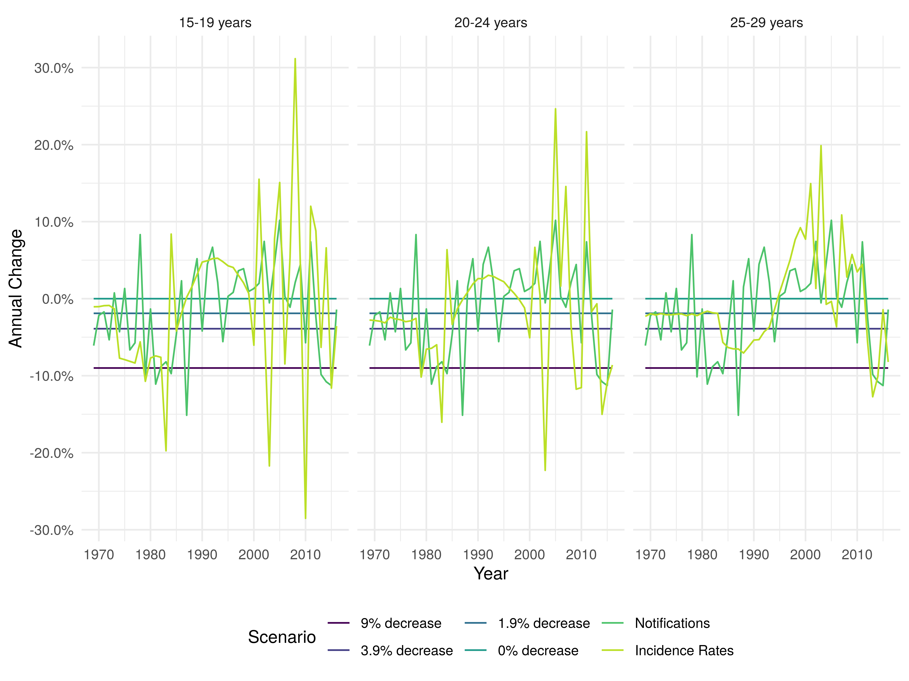

---
output:
  pdf_document: default
  html_document: default
---
# Reassessing the evidence for universal school-age Bacillus Calmette Guerin (BCG) vaccination in England and Wales {#sutherland}


```{r 05-knitr-options, include = FALSE}
knitr::opts_chunk$set(echo = FALSE, dpi = 320,
                      fig.width = 8, fig.height = 8,
                      out.width = "80%", fig.align = 'center')
```

```{r 05-setup, include = FALSE}
## Packages
library(tidyverse)
library(prettypublisher)
library(knitr)
library(purrr)
library(scales)
library(kableExtra)

## Read formated results
## See https://github.com/seabbs/AssessBCGPolicyChange/blob/master/vignettes/paper.Rmd
## for code required to reproduce 
## Chapter is an edited version of the orginal reproducible document.
## Original results found at: https://github.com/seabbs/AssessBCGPolicyChange/blob/master/vignettes/results/paper
## Original figures found at: https://github.com/seabbs/AssessBCGPolicyChange/blob/master/docs/articles/paper_files/figure-html
##Wordcount: 4274


## Functions for results read in
read_formated <- function(name) {
  path <- file.path("chapters/evidence-policy-change", paste0(name, ".rds"))
  
  tmp <- readRDS(path)
  
  return(tmp)
}


load_formated <- function(name) {

  path <- file.path("chapters/evidence-policy-change", paste0(name, ".rda"))
  
  load(path, envir = globalenv())
}

## Read in all relevent rda's
rda_list <- c("annual_nots-mw", "annual_nots_tab", "avg-inc", "avg-not",
              "mann-whitney", "max-not",
              "min-not", "model-valid",
              "table-vac-prev")

walk(rda_list, ~ load_formated(.))


```

## Introduction


Prior to the change in BCG vaccination policy in 2005 (see Chapter \@ref(background)) several studies were carried out to assess the impact of any potential policy change. In this Chapter I aimed to update one of these studies.

I recreated a previous approach for estimating the impact of ending the BCG schools scheme in England and Wales, updating the model with parameter uncertainty, and measurement error. I investigated scenarios considered by the Joint Committee on Vaccination and Immunisation, and explored new approaches using notification data (see Chapter \@ref(data)). I estimated the number of vaccines needed to prevent a single notification, and the average annual additional notifications caused by ending the BCG schools’ scheme. This work was adapted from a preprint^[Preprint: https://doi.org/10.1101/624916] supervised by Hannah Christensen and Ellen Brooks-Pollock.

## Background

The Bacillus Calmette–Guérin (BCG) vaccine remains the only licensed vaccine for use against Tuberculosis (TB), although its use globally is controversial due to evidence of variable effectiveness,[@Mangtani2014a] and waning protection 10-15 years after vaccination.[@Abubakar2013] Global usage of the BCG varies between no vaccination, universal vaccination, and high-risk group vaccination and may target either neonates or school-aged children.[@Pilger2012b; @Zwerling2011a] The World Health Organization (WHO) recommends vaccination for all neonates as early as possible after birth in high burden settings, with vaccination in low burden settings being dependent on the country specific epidemiology of TB.[@WHO2017] This recommendation is based on the strong evidence that the BCG is highly protective in children,[@Rodrigues1993; @Colditz1994] whilst its effectiveness has been shown to vary with latitude when given later in life (see Chapter \@ref(background)).[@Mangtani2014] 

In England and Wales, universal school-aged (13 years old) vaccination was introduced after a MRC trial in the 1950s estimated BCG's effectiveness at 78% in the ethnic White UK born population.[@Hart1972] The policy remained in place until 2005, when England and Wales changed to targeted vaccination of high risk neonates. The 2005 change in BCG vaccination policy was motivated by evidence of decreased transmission of TB, an increasing proportion of TB cases occurring in the non-UK born,[@PHE2017] and modelling evidence that suggested stopping the BCG schools scheme would have minimal long term effects on incidence rates.[@Sutherland1989] Due to the complex nature of both TB and the BCG vaccine, the ongoing impact of this change in policy is hard to directly estimate, with decision makers relying on expert opinion, evidence from surveillance data, and insight from modelling studies.  

In 1987, an assessment of the school-age vaccination program was carried out in England and Wales.[@Sutherland1989] This study was used, combined with a sensitivity analysis of notification rates, as supporting evidence by the Joint Committee on Vaccination and Immunisation (JCVI) BCG subgroup for the change in vaccination policy.[@JVCIBCG2002; @JVCIBCG2003] This chapter aims to re-evaluate this modelling, and re-estimate the predicted impact of stopping the schools scheme.

## Methods

### Modelling the impact of ending the BCG schools scheme

I implemented Sutherland et al.’s model for estimating the impact of ending the BCG schools scheme.[@Sutherland1989] This model was based on data from TB notification surveys conducted in 1973, 1978, and 1983.[@Sutherland1987a] These were used to estimate incidence rates, stratified by BCG vaccination status (vaccinated, unvaccinated, and ineligible), in the ethnic White UK born population of England and Wales aged 15-19 years old, 20-24 years old and 25-29 years old. Future incidence rates were forecast by assuming an annual decrease in incidence rates, which was based on historic trends.[@Sutherland1989; @Springett1988] Primary impacts from ending the schools scheme were estimated by calculating the difference in incidence rates between the vaccinated and unvaccinated populations. Additional notifications from TB transmission were then calculated using a transmission chain model. Based on data availability the model used a 5 year timestep. More detail is given in the following sections.

#### Estimating notification rates

The effectiveness of the BCG vaccine was originally estimated by an MRC trial in 1953 at 78% in the United Kingdom.[@Hart1972] As a follow up to this trial members of the MRC bio-statistics unit conducted a series of notification surveys attempting to ascertain any change in effectiveness, as well as acting as an estimate of notification rates across different demographics.[@Sutherland1987a] Notification surveys were carried out at 5 year intervals in 1973, 1978 and 1983; looking at those aged 15-24 years old in England and Wales. For the 1983 survey records of BCG status, Tuberculin status and ethnicity were extracted from the records of notifying physicians and the records of the local health and education authorities. Totals, across the study period, were then aggregated for the following groups: Tuberculin negative and BCG positive, Tuberculin negative and BCG negative, Tuberculin positive and not vaccinated and those who did not participate. These totals were then combined with the population estimates for each cohort at 13 years of age to estimate the ethnic make up of the population, and to construct notification rates for each category. Data were drawn from a range of sources including: Office of National Statistics data; annual local authority returns for total tuberculin test results; BCG vaccinations in the schools scheme; and the Labour force survey (1983).

For 1983 this corresponded with 874 notifications in the ethnic White UK born in England and Wales, between 15-24, with participation at 80%. As the number of Tuberculin negative subjects not given BCG was unreported this was estimated at 1.9% of those vaccinated with the BCG. Allowances were also made for those already vaccinated prior to the schools scheme. See [@Sutherland1987a] for full details of the survey construction and the additional assumptions used to give similar estimates for both the 1973 and 1978 surveys. The findings of these surveys were as follows: in the ethnic White population notification rates had fallen by an annual average of 9% and BCG efficacy had remained high.[@Sutherland1989; @Springett1988]

Evidence suggests that the BCG vaccine has a high efficacy for at least the first 15 years after vaccination, therefore the authors extrapolated from the data on the 20-24 cohort to a theoretical 25-29 year old cohort. Data on the notifications for the first 6 months of the 1983 survey was available and this was then scaled using the ratio of notifications from this age group against the total number of notifications recorded in that year. Population estimates from the 20-24 cohort were adjusted for all causes of mortality (0.34%). Migration was ignored. The tuberculin positive cohort had a sharp decline in the previous two cohorts, therefore it was assumed that this continued. Lastly, the efficacy was estimated as being that seen in the 20-24 cohort but with the same decline in protection seen between the last two cohorts. These assumptions allowed notification rates to be estimated for the 25-29 year old population, resulting in a complete cohort over the projected 15 years of BCG effectiveness.

#### Construction of forward estimates

Based on these estimated notification rates Sutherland et al. then sought to quantify the ongoing risk of developing notified TB, projected forward in time, for both the vaccinated and unvaccinated populations. To construct these estimates several key assumptions, based on the results seen in the previous surveys, were made. Firstly, it was assumed that efficacy was not degrading within the ethnic White population and therefore historic estimates would continue to apply into the future. Additionally, it was assumed that the decay of 9% in notification rates, across all ethnic White populations, would continue indefinitely.

These assumptions allow the notification rates in both the BCG vaccinated and unvaccinated groups to be projected forward in time. By assuming that the schools scheme is responsible for the observed variation between vaccinated and unvaccinated rates the rate of prevented cases can then be estimated. By scaling this against a cohort of 100,000 13 year olds the number of prevented cases over a 15 year period can be projected for each cohort. By dividing the total number in a given cohort by the number of prevented cases the estimated number of vaccines required to prevent a single case in the 15 year period can then be calculated.

To estimate the total number of prevented notifications, for each cohort, in England and Wales the total number receiving the BCG and the coverage of the schools scheme was required. The coverage of the BCG schools scheme was estimated from annual reports of the DHSS and was assumed to be 75% for all years. The number of BCG vaccines given each year was estimated from the DHSS returns for the years 1967 to 1981, it was then taken as 75% of the estimated ethnic White population aged 13 years from 1982-1996, for each 5 year period thereafter it was assumed to be 2.1 million. 

Using the above information and the projected differences between vaccinated and unvaccinated notificationrates allows the number of prevented notifications for each age group to be found for each year. This can then be combined to give the total number of prevented notifications for those aged between 15-29. To understand these estimates, estimates of the projected yearly notifications if the scheme continues are required. These totals were derived from the vaccinated and unvaccinated rates supplemented with similar projections from the tuberculin positive or otherwise ineligible sourced from the 1983 BCG survey.[@Sutherland1987a]

#### Transmission chain model

The TB transmission model is defined as follows (reproduced from Sutherland et al.):

1. Estimate the total expected number of secondary notifications ($T$) arising from any single primary notification using the following, 

$$ T = (1-d)^z < 1 $$
Where $d$ is the percentage decay in notification rates, and $z$ is the average interval between the notification of any individual and the notification of the patient who infected them.

2. Relate $T$ to the number of notifications in each generation using the initial generation size ($x$) with the following power series,

$$ T=x+x^2+x^3+ . . = \frac{x}{1-x} $$
3. Estimate the expected average interval between each primary notification and all secondary notifications ($Z$). This is defined to be the sum of time to all notifications, weighted by the fraction in each generation, divided by the sum of all notifications. Mathematically this is, 

$$ Z = \frac{xz + x^{2}2z + x^{3}3z + . .}{x+x^2+x^3+ . . }= \frac{z}{1-x} $$

#### Transmission chain model additions

Implementing the model required several assumptions not detailed in [@Sutherland1989]. Firstly, as incidence rates for those ineligible for the BCG schools scheme are not published, I assumed that they were equal to those in the unvaccinated population. In addition, in order to reproduce the distribution of cases over time reported in Sutherland et al. I introduced an additional model step and parameter; the percentage of secondary cases due to a primary case in the first year after activation ($f$). The distribution of secondary cases ($N$) was then modelled by first estimating the number of secondary cases that occurred in the current year and then estimating how many secondary cases occurred 5 years later (due to the 5 year timestep). This iterative process can be summarised as follows,

$$ N^{Current} = P T  f  x $$
$$ N^{Projected} = (PT - N^{Current})(1 - d)^{L-Z} $$ 
$$ N_i^{Total} = N^{Current}_i + N^{Projected}_{i-1} $$

Where $P$ is the number of primary notifications, $i$ is the year of interest, $N^{Current}$ is the number of secondary cases in the current  year, $N^{Projected}$ is the number of secondary cases in the subsequent timestep, and $L$ is the model timestep (here set to be 5).

I fitted this parameter using least squares to the original estimates of the total notifications due to ending the scheme under several scenarios, for several years. I validated the fitted model by comparing the results with those from the original implementation. Using the mean absolute percentage error, normalised by the orginal estimate.

### Updating model parameter estimates

Incidence rates were included as point estimates in [@Sutherland1989]; in the updated model I included uncertainty in these rates. I estimated notifications for 1973, 1978, and 1983, using published incidence rates and population estimates. Samples were then generated using a Poisson distribution.[@Sutherland1989; @Sutherland1987a] These samples were then used to estimate a distribution of incidence rates. Sutherland et al. assumed a serial interval of 2 years between linked infections. I updated this assumption using, the currently best available estimate, of 1.44 (95% CI 1.29 to 1.63) years.[@Borgdorff2011]

I considered the original assumption of a 9% annual decrease in incidence rates as well as three scenarios based on those considered by the JCVI BCG subgroup:[@JVCIBCG2002; @JVCIBCG2003] these were a 3.9% decrease, a 1.9% decrease, and no change annual in incidence rates. I also estimated the annual decrease in incidence rates in the ethnic White UK born using two proxy measures. The first proxy measure was the annual change in notifications in England and Wales, which was estimated using data from Public Health England (PHE). The standard deviation (SD) of this measure was then calculated using the `prop.test` function in R.[@R] The second proxy used was the annual decrease in the UK born age-specific incidence rates in the English population. These were calculated using notification data from the Enhanced TB surveillance system (ETS) and the June Labour Force Survey (see Chapter \@ref(data)).[@PHE2017] Incidence rates (with SDs) were estimated using the epiR package.[@EpiR] Uncertainty was incorporated by sampling from a normal distribution for both proxy measures. Data collection for the ETS began in 2000, I therefore estimated incidence rates between 1984 and 1999, and for the years between notifications surveys (1974-1977 and 1979-1892), using LEOSS regression for each sample fitted to the incidence rates published in [@Sutherland1989], and the estimated incidence rates from 2000 on-wards. LOESS (locally estimated scatterplot smoothing) is a local regression method.[@FoxSnow:2019] It combines multiple regression models in a k-nearest neighbours meta-model. This approach allows nonlinear trends to be fitted to using a series of linear models. For years prior to 1973 the annual decreases were assumed to be the mean of the previous 3 years of data. For both proxy measures the annual decreases in incidence rates post 2016 were assumed to be the average of the estimates in 2013, 2014, and 2015. 


### Statistical analysis

For each scenario, I ran the model until 2028 with 10,000 parameter samples. I tested the difference between scenarios using the Mann-Whitney test for both the number of vaccines needed to prevent a single case in 15 years after vaccination for a cohort aged 13-14 years old at vaccination and the total number of additional notifications caused by ending the BCG schools scheme. As in [@Sutherland1989] a 15 year time horizon was used with 5 year intervals. The year closest to the year of the change in vaccination policy (2005), which had model estimates, was used as the baseline. The code for this analysis is available online^[Code: https://github.com/seabbs/AssessBCGPolicyChange]


## Results

### Model validation

The model produced results that were comparable with those from [@Sutherland1989] (Table \@ref(tab:model-validation); Table \@ref(tab:model-validation-2)). When estimating the total notifications from ending the BCG schools scheme at different times in ethnic White UK born adults aged 15-29 years old in England and Wales the model had a median absolute error of `r median_lll_hhh_error` and a maximum absolute error of `r {pretty_max}` when compared to [@Sutherland1989]. I found that the percentage of cases in the first year was $f=0.764$ when fitted to the Sutherland et al. estimates using the least squares method.

```{r model-validation}
comparision_tab[, 1:10] %>% 
  set_names(c("Year of Ending Scheme", rep(c("Original", "Recreated",	"Difference"), 3))) %>% 
  kable(
    caption.short = "Comparison of results published by Sutherland et al. vs. the recreated model.",
    caption = "Comparison of results published by Sutherland et al. vs. the recreated model. This table shows the total notifications including primary and secondary effects from ending the BCG schools scheme at various times in ethnic White adults aged 15-29 years old in England and Wales.", booktabs = TRUE) %>%
  add_header_above(c(" " = 1, "1988" = 3,  "1993" = 3,  "1998" = 3)) %>% 
  column_spec(1, width = "2cm") %>%
  kable_styling(latex_options = "hold_position") %>% 
  landscape()  %>% 
  kable_styling(font_size = 10) 
```


```{r model-validation-2}
comparision_tab[, -(2:10)] %>% 
  set_names(c("Year of Ending Scheme", rep(c("Original", "Recreated",	"Difference"), 3))) %>% 
  kable(
    caption.short = "Continued: Comparison of results published by Sutherland et al. vs. the recreated model.",
    caption = "Continued: Comparison of results published by Sutherland et al. vs. the recreated model. This table shows the total notifications including primary and secondary effects from ending the BCG schools scheme at various times in ethnic White adults aged 15-29 years old in England and Wales.", booktabs = TRUE) %>%
  add_header_above(c(" " = 1, "2003" = 3,  "2008" = 3, "2013" = 3)) %>% 
  column_spec(1, width = "2cm") %>%
  kable_styling(latex_options = "hold_position") %>% 
  landscape()  %>% 
  kable_styling(font_size = 10) 
```


### Annual change in TB incidence rates

I found that the assumption of a 9% annual decrease in incidence rates in the ethnic White UK born was not comparable to estimates using either notification data or age-specific incidence rates in the time period studied (Figure \@ref(fig:plot-annual-change)). The median annual decrease estimated using notifications was `r  str_replace(avg_not, "Q", "Quantiles (Q)")`, with a maximum of `r max_not$pa_change` in `r max_not$Year` and a minimum of `r min_not$pa_change` in `r min_not$Year`. Using age-specific incidence rates I estimated the median annual decrease in incidence rates for 15-19 year olds was `r avg_inc[1]`, `r avg_inc[2]` for 20-24 year olds, and `r avg_inc[3]` for 25-29 year olds. There was substantial variation between years and a high degree of uncertainty.

```{r plot-annual-change, fig.scap = "Annual percentage change in ethnic White UK born incidence rates for those aged 15-19, 20-24, and 25-29 years old under different scenarios.", fig.cap = "Annual percentage change in ethnic White UK born incidence rates for those aged 15-19, 20-24, and 25-29 years old under different scenarios. For the notification and incidence rate scenarios each line represents the median of 10,000 parameter samples.", out.extra = ""}

```


## Vaccines required to prevent a single notification

I found that updating parameter values, and incorporating uncertainty, did not alter the number of vaccines required to prevent a single notification within 15 years in a cohort vaccinated at school-age, when the annual decrease in TB incidence rates was assumed to be 9% (Figure \@ref(fig:graph-vacs-to-prev); Table \@ref(tab:vac-prevent-tab)). However, the updated estimate had a wide range (`r vac_2004_9` vaccines required in 2004). As the assumed annual decrease in incidence rates was reduced the number of vaccines required to prevent a single notification also reduced; an estimated `r vac_2004_1` vaccines were required to prevent a case in 2004 when the annual decrease was assumed to be 1.9%. Estimates of the number of vaccines required to prevent a notification were comparable but not equivalent when the annual decrease was estimated using notifications (`r vac_2004_nots`, P: `r p_not_vs_1_2004`) and age-specific incidence rates (`r vac_2004_inc`, P: `r p_inc_vs_1_2004`). The estimate using incidence rates had a high degree of uncertainty (Figure \@ref(fig:graph-vacs-to-prev); Table \@ref(tab:vac-prevent-tab)). The number of vaccines required increased slightly over time with `r vac_prevent_1_2009` required in 2009, `r vac_prevent_1_2014` required in 2014, and `r vac_prevent_1_2019` required in 2019 when an annual decrease of 1.9% in incidence rates was assumed.

```{r graph-vacs-to-prev, fig.scap = "Vaccines required in a cohort of those vaccinated at school-age to prevent a single case of TB within 15 years of vaccination in 2004, 2009, 2014, or 2019.", fig.cap = "Vaccines required in a cohort of those vaccinated at school-age to prevent a single case of TB within 15 years of vaccination in 2004, 2009, 2014, or 2019. The years presented were dictated by the 5 year timestep of the model. The percentage annual decrease scenarios considered were based on those considered by the JCVI BCG subgroup, with the addition of a scenario using aggregate notification data and a scenario using estimates of age-specific incidence rates in the UK born. Each boxplot summarises the output of 10,000 model simulations for each scenario. Outliers have been omitted for clarity.", out.extra = ""}
knitr::include_graphics("chapters/evidence-policy-change/graph-vacs-to-prev-1.png")
```
 
```{r vac-prevent-tab}
  read_formated("tab-vac-prevent") %>% 
  kable(caption = "The median number (with the 2.5\\% and 97.5\\% quantiles) of vaccines required to prevent a single case of TB within 15 years in a ethnic White UK born adult vaccinated at 13 years old.",
               booktabs = TRUE) %>% 
  landscape() %>% 
  kable_styling(latex_options = "hold_position") %>% 
  kable_styling(font_size = 8) %>% 
  column_spec(2, width = "2cm")
```


### Average annual additional cases from ending the BCG schools scheme at various dates

I found that updating parameter values, and incorporating uncertainty, did not alter the average annual additional notifications from stopping the BCG schools scheme when the annual decrease was assumed to be 9% (Figure \@ref(fig:graph-avg-add-not); Table \@ref(tab:annual-prevent-tab)). There was a large degree of uncertainty in this estimate with `r avg_annual_2001_9` notifications prevented annually if vaccination was stopped in 2001. As the assumed annual decrease in incidence rates was reduced the annual number of additional notifications prevented increased with `r avg_annual_2001_1` notifications prevented annually when the annual decrease was assumed to be 1.9% and vaccination stopping in 2001. There was some evidence that the average annual number of notifications prevented was greater when the annual decrease was estimated using notifications (`r avg_annual_2001_nots`, P: `r a_not_vs_1_2001`) and age-specific incidence rates (`r avg_annual_2001_inc`, P: `r a_inc_vs_1_2001`), compared to an assumed annual decrease of 1.9% (Figure \@ref(fig:graph-avg-add-not); Table \@ref(tab:annual-prevent-tab)). The estimate made using incidence rates again had a high degree of uncertainty. When an annual decrease of 1.9% was assumed the number of notifications prevented annually reduced with time: `r avg_annual_1_2006` from ending vaccination in 2006; `r avg_annual_1_2011` from ending vaccination in 2011, and `r avg_annual_1_2016` from ending vaccination in 2016.

```{r graph-avg-add-not, fig.scap = "Annual additional notifications in 15-29 year olds from stopping the BCG schools scheme in 2001, 2006, 2011, and 2016 until 2028.", fig.cap = "Annual additional notifications in 15-29 year olds from stopping the BCG schools scheme in 2001, 2006, 2011, and 2016 until 2028. The years presented were dictated by the 5 year timestep of the model. The percentage annual decrease scenarios considered were based on those considered by the JCVI BCG subgroup, with the addition of a scenario using aggregate notification data and a scenario using estimates of age-specific incidence rates in the UK born. Each boxplot summarises the output of 10,000 model simulations for each scenario. Outliers have been omitted for clarity.", out.extra = ""}
knitr::include_graphics("chapters/evidence-policy-change/graph-avg-add-nots-1.png")
```


```{r annual-prevent-tab}
  read_formated("tab-annual_nots_prevented") %>% 
  kable(
    caption = "The median number (with the 2.5\\% and 97.5\\% quantiles) of additional annual notifications due to ending the BCG schools scheme in selected years.", booktabs = TRUE) %>% 
  landscape() %>% 
  kable_styling(latex_options = "hold_position")  %>% 
  kable_styling(font_size = 8) %>% 
  column_spec(2, width = "2cm")
```


## Discussion

The existing method for estimating the impact of the BCG schools scheme produced uncertain estimates of the impact of ending the scheme in all years evaluated when parameter uncertainty for incidence rates were included. Incorperating an improved estimate for the serial interval of TB resulted in increased uncertainty in model results. Updating the annual decrease in TB notifications based on both notifications and using age-specific incidence rates resulted in increased TB cases due to ending universal school-age vaccination in all years considered. These updates resulted in fewer vaccines required to prevent a single notification in those vaccinated and an increase in the number of annual additional notifications from ending the scheme. A scenario with a 1.9% annual decrease in incidence rates was most comparable to the results based on notifications. The 9% annual decrease used by Sutherland et al. was shown to substantially overestimate the number of vaccines needed to prevent a single case and underestimate the number of additional TB cases from ending the schools scheme.

This chapter reassesses a key piece of the quantitative evidence used to motivate the change in BCG vaccination policy in 2005. The results provide new insights into the uncertainty of the previously published model predictions by including parameter uncertainty and measurement error. Updating the model with data based on notifications and incidence rates showed that the historic estimates of the impact of ending the BCG scheme were overly optimistic. A limitation of this approach was that  data on incidence rates in the ethnic White UK born in England and Wales were not available. However, I considered two approaches to proxy them, and investigated multiple scenarios based on those explored by the JCVI BCG subgroup. The simulation approach used here is not the most accurate method for estimating the impact of ending the BCG schools’ scheme as it relies on numerous assumptions based on the available knowledge in 1987. The strength of this work is that the estimates were based on the framework used to inform policy making. This allowed the strength of model used in the decision-making process to be assessed once parameter uncertainty had been incorperated. This would not have been possible if the impact had been assessed using only the observed data. It also allowed estimates based on updated data to be compared to historic estimates within the same framework. If a different framework had been used then these estimates would not have been comparable. An additional weakness of the modelling framework used in this chapter is that it did not include the whole population or age groups outside those directly affected by vaccination. Furthermore, heterogeneous mixing between these groups is likely to be important. The exclusion of these factors means that the results are conservative. A final limitation is that this chapter only considers the impact of ending the BCG schools scheme and not the impact of the introduction of the targeted neonatal vaccination program. This should be considered when evaluating the change in policy as a whole.

Little work has been done - beyond this thesis - to assess the impact of the 2005 change in BCG vaccination policy or to assess the quantitative evidence used in decision making. However, multiple studies have evaluated the cost effectiveness of various BCG programs and the impact of switching between them. A cluster-randomised trial in Brazil found that BCG vaccination of those at school-age was cheaper than treatment and would prevent one TB case per 381 vaccinations even with a vaccine effectiveness of only 34% (8-53%).[@Pereira2012] This is substantially fewer than the estimate of `r vac_prevent_1_2014` vaccines required to prevent a single notification within 15 years in 2014 (this was the most comparable year from the model). However, the same trial found that for regions close to the equator BCG effectiveness was low in school-age children but unchanged in neonates,[@Barreto2014a] highlighting the importance of considering the BCG vaccines reduced effectiveness near the equator when determining vaccination policy.[@Fine1995] There is also some research which supports universal re-vaccination of those at school-age, in countries with high incidence and universal vaccination of neonates, as it may be cost effective when BCG effectiveness is moderate to high.[@Barreto2014a; @Dye2013a] There is some evidence that targeted vaccination of high risk neonates maybe more cost effective than universal vaccination of neonates.[@Usher2016; @Hersh2003] However, a study in Sweden found that incidence rates in Swedish-born children increased slightly after universal vaccination of neonates was discontinued in favour of targeted vaccination.[@Romanus1992] In France, which switched from universal vaccination of neonates to targeted vaccination in 2007, it has also been shown that targeted vaccination reduced coverage in those most at risk.[@Guthmann2011] Targeted vaccination may not be more cost effective that universal vaccination when possible reductions in transmission are considered. This chapter indicates that a substantial number of cases due to transmission may be preventable if universal school-age BCG vaccination was still in place. This result is dependent on the effectiveness of BCG vaccination when given later in life, for which there is good evidence in the ethnic White UK born.[@Hart1972] I did not consider neonatal vaccination which would be less impacted by BCG's effectiveness reducing when given later in life, but would also be less likely to result in the same reductions in ongoing transmission.

This chapter indicates that some of the evidence used to justify the 2005 change in BCG vaccination policy may have underestimated the impact of ending the scheme. It highlights the importance of including both parameter and measurement error, as excluding these sources of variation may lead to spuriously precise results. This is problematic for policy makers as the worst case scenario often needs to be considered. In addition, my exploration of the assumptions used to estimate the annual change in TB incidence rates in the ethnic White UK born illustrates the structural impact of assuming an annual decrease in TB incidence rates. More realistic estimates of the annual decrease in incidence rates resulted in a greatly increased impact of ending the BCG schools scheme. Policy makers should consider these updated estimates when assessing the role of BCG vaccination in those at school-age. However, decisions regarding vaccine policy require economic evaluation, which discounts costs and benefits in the future; discounting has not been applied in this study which estimates the epidemiolgical impact of vaccination only. 

This Chapter has reassessed some of the evidence previously used in decision making, updating the approach with new data. However, as 15 years of detailed surveillance data have been collected since the ending of the BCG schools scheme it is now possible to use regression-based approaches to estimate the direct impact on incidence rates of ending the BCG schools scheme (see Chapter \@ref(direct-eff)). These approaches could also be used to estimate the impact of vaccinating high-risk neonates, which may outweigh any negative impacts of ending the BCG schools scheme. In addition, the development (see Chapter \@ref(model-development)), and use, of a transmission dynamic model would allow the more accurate estimation of indirect effects and the forecasting of long-term impacts (see Chapter \@ref(model-results)).

## Summary

* I found a 1.9% annual decrease in TB incidence rates best matched estimates from notifications.

* I estimate that 1600 (2.5-97.5% quantiles (Q): 1300 - 2100) vaccines would have been required to prevent a single notification in 2004. 

* If the scheme had ended in 2001, 302 (2.5-97.5% Q: 238 - 369) additional annual notifications would have occurred compared to if the scheme had continued. If the scheme ended in 2016, 120 (2.5-97.5% Q: 88 - 155) additional annual notifications would have occurred.

* The estimates of the impact of ending the BCG schools scheme were highly sensitive to the annual decrease in incidence rates. 

* The impact of ending the BCG schools scheme was found to be greater than previously thought when parameter values were updated and notifications were used.

* The results highlight the importance of including uncertainty when forecasting the impact of changes in vaccination policy.

* The code for the analysis contained in this Chapter can be found at: 
[doi.org/10.5281/zenodo.2583056](https://doi.org/10.5281/zenodo.2583056)^[Alternatively available from: https://github.com/seabbs/AssessBCGPolicyChange]
