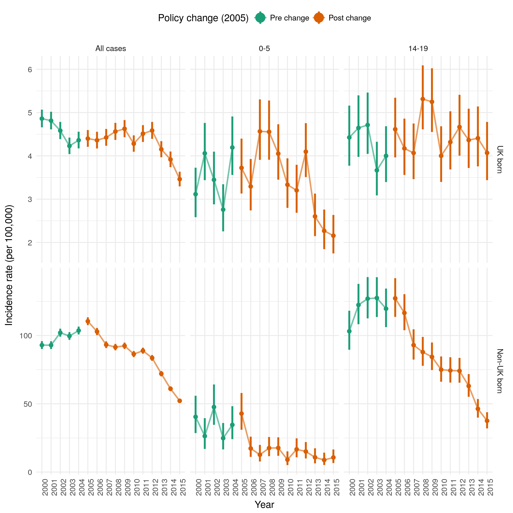

---
output:
  pdf_document: default
  html_document: default
---
# Estimating the effect of the 2005 change in BCG policy in England: A retrospective cohort study {#direct-eff}

```{r 07-knitr-options, include = FALSE}
knitr::opts_chunk$set(echo = FALSE, dpi = 320,
                      fig.width = 8, fig.height = 8,
                      out.width = "80%", fig.align = 'center', cache = FALSE)
```

```{r 07-setup, include = FALSE}
## Packages
library(tidyverse)
library(prettypublisher)
library(knitr)
library(kableExtra)

## Read formated results
## See https://github.com/seabbs/DirectEffBCGPolicyChange/blob/master/vignettes/paper.Rmd
## for code required to reproduce 
## Chapter is an edited version of the orginal reproducible document.
##Wordcount: 4498
read_formated <- function(name) {
  path <- file.path("chapters/direct-eff-bcg-change", paste0(name, ".rds"))
  
  tmp <- readRDS(path)
  
  return(tmp)
}

## Journal options for functions.
pretty_per_effect <- partial(prettypublisher::pretty_per_effect, sep = ", ", note = "95%CI ")
```

## Introduction


In 2005, England changed from universal Bacillus Calmette–Guérin (BCG) vaccination of school-age children to targeted BCG vaccination of high-risk children at birth. In this Chapter I aimed to assess the effects of this change in vaccination policy on the populations targeted by each vaccination scheme.

I combined notification data from the Enhanced TB Surveillance (ETS) system, with demographic data from the Labour Force Survey (LFS) to construct retrospective cohorts of individuals in England relevant to both the universal, and targeted vaccination programmes between Jan 1, 2000 and Dec 31, 2010. For each cohort, I estimated incidence rates over a 5 year follow-up period and used Poisson and negative binomial regression models in order to estimate the impact of the change in policy on TB. This work was adapted from a preprint^[Preprint: https://doi.org/10.1101/567511] supervised by Hannah Christensen and Ellen Brooks-Pollock. Nicky Welton provided guidance on the statistical methods used.

## Background

In 2005 England changed its Bacillus Calmette–Guérin (BCG) vaccination policy against tuberculosis (TB) from a universal programme aimed at 13 and 14 year olds to a targeted programme aimed at high-risk neonates (see Chapter \@ref(background)). High risk babies are identified by local TB incidence and by the parents’ and grandparents’ country of origin. The change in policy was motivated by evidence of reduced TB transmission,[@PHE2016a; @Fine2005a; @Teo2006] and high effectiveness of the BCG vaccine in children,[@Rodrigues1993; @Colditz1994; @Roy2014] and variable effectiveness in adults.[Mangtani2014; @Zwerling2011] Little work has been done to evaluate the impact of this change in vaccination policy.

Globally, several countries with low TB incidence have moved from universal vaccination, either of those at school-age or neonates, to targeted vaccination of neonates considered at high-risk of TB  (see Chapter \@ref(background)).[@Zwerling2011a] In Sweden, which discontinued universal vaccination of neonates in favour of targeted vaccination of those at high risk, incidence rates in Swedish-born children increased slightly after the change in policy.[@Romanus1992] In France, which also switched from universal vaccination of neonates to targeted vaccination of those at high-risk, a study found that targeted vaccination of neonates may have reduced coverage in those most at risk.[@Guthmann2011] 

The number of TB notifications in England increased from 6929 in 2004 to 8280 in 2011 but has since declined to 5137 in 2017 (see Chapter \@ref(data)).[@PHE2016a] A recent study found that this reduction may be linked to improved TB interventions.[@Thomas2018] Directly linking trends in TB incidence to transmission is complex because after an initial infection an individual may either develop active disease, or enter a latent stage which then may later develop into active disease. Incidence in children is a proxy of TB transmission, because any active TB disease in this population is attributable to recent transmission. Using this approach it is thought that TB transmission has been falling in England for the last 5 years, a notion supported by strain typing.[@PHE2016a] However, this does not take into account the change in BCG policy, which is likely to have reduced incidence rates in children.

Although the long term effects of BCG vaccination such as reducing the reactivation of latent cases and decreasing on-wards transmission are not readily detectable over short time scales the direct effects of vaccination on incidence rates can be estimated in vaccinated populations, when compared to comparable unvaccinated populations.[@Parikh2016a] Here, I aimed to estimate the impact of the 2005 change in BCG policy on incidence rates, in both the UK and non-UK born populations, directly affected by it.

## Methods

### Data source

Data on all notifications from the ETS system from Jan 1, 2000 to Dec 31, 2015 were obtained from Public Health England (PHE). The ETS is maintained by PHE, and contains demographic, clinical, and microbiological data on all notified cases in England (see Chapter \@ref(data)). A descriptive analysis of TB epidemiology in England is published each year, which fully details data collection and cleaning.[@PHE2016a]

I obtained yearly population estimates from the April to June LFS for 2000-2015. The LFS is a study of the employment circumstances of the UK population, and provides the official measures of employment and unemployment in the UK (see Chapter \@ref(data)). Reporting practices have changed with time so the appropriate variables for age, country of origin, country of birth, and survey weight were extracted from each yearly extract, standardised, and combined into a single data-set (see Section \@ref(demographic-data)).

### Constructing Retrospective cohorts {#cohort-definition}

I constructed retrospective cohorts of TB cases and individuals using the ETS and the LFS. Tuberculosis cases were extracted from the ETS based on date of birth and date of TB notification.

Cohort 1: individuals aged 14 years between 2000 and 2004, who were notified with TB while aged between 14 and 19 years.

Comparison cohort 1: individuals aged 14 years between 2005 and 2010, who were notified with TB while aged between 14 and 19 years.

Cohort 2: individuals born between 2005 and 2010, who were notified with TB while aged 0 to 5 years.

Comparison cohort 2: individuals born between 2000 and 2004, who were notified with TB while aged 0 to 5 years.

Cohorts were stratified by vaccination programme using age criteria and then stratified further by whether the scheme was in place during the time period they entered the study. Each cohort was further stratified by UK birth status, with both non-UK born and UK born cases assumed to have been exposed to England’s vaccination policy. Corresponding population cohorts were calculated using the LFS population estimates, resulting in eight population level cohorts, each with 5 years of follow-up (Table \@ref(tab:07-cohorts)).

```{r 07-cohorts}
read_formated("cohorts") %>% 
  kable(caption = "Summary of relevance and eligibility criteria for each cohort.", booktabs = TRUE) %>% 
  add_footnote(label = c("* Eligible signifies that the cohort fit the criteria for the programme",
                       "and entered the study during the time period it was in operation", 
                       " not that the cohort was vaccinated by the programme."),
               notation = "none") %>% 
  column_spec(1:6, width = "2cm") %>% 
  kable_styling(latex_options = "hold_position")
```


## Statistical methods overview

I estimated incidence rates (with 95% confidence intervals) by year, age and place of birth as (number of cases) divided by (number of individuals of corresponding age) (see Chapter \@ref(data)). UK birth status was incomplete, with some evidence of a missing not at random mechanism (MNAR). I imputed the missing data using a gradient boosting method (see Section \@ref(imp-uk-birth-status)). I then used descriptive analysis to describe the observed trends in age-specific incidence rates over the study period, comparing incidence rates in the study populations relevant to both vaccination programmes before and after the change in BCG policy.

I calculated Incidence Rate Ratios (IRRs) for the change in incidence rates associated with the change in BCG vaccination policy (modelled as a binary breakpoint at the start of 2005) for both the UK born and non-UK born populations that were relevant to the universal programme, and for the targeted programme using a series of increasingly complex models. I considered the following covariates: age,[@PHE2016a; @Zwerling2011] incidence rates in both the UK born and non-UK born who were not in the age group of interest,[@PHE2016a] and year of study entry (as a random intercept). I first investigated a univariable Poisson model, followed by combinations of covariates (Table \@ref(tab:07-model-spec)). I also investigated a negative binomial model adjusting for the same covariates as in the best fitting Poisson model. The models were estimated with a Bayesian approach using Markov Chain Monte Carlo (MCMC), with default weakly informative priors (see  Section \@ref(prior-choice)). Model fit, penalised by model complexity, was assessed using the leave one out cross validation information criterion (LOOIC) and its standard error.[@Vehtari2016] Models were ranked by goodness of fit, using their LOOIC, with a smaller LOOIC indicating a better fit to the data after adjusting for the complexity of the model. No formal threshold for a change in the LOOIC was used, with changes in the LOOIC being evaluated in the context of their standard error. The inclusion of the change in policy in the best fitting model was tested by refitting the model excluding the change in policy and estimating the improvment in the LOOIC. Once the best fitting model had been identified I estimated the number of cases prevented, from 2005 until 2015, for each vaccination programme in the study population relevant to that programme (see Section \@ref(magnitude-estimation)). 

```{r 07-model-spec}
## Model description table
read_formated("model-spec") %>% 
  kable(caption = "Complete definition of each model, ordered by increasing complexity.", booktabs = TRUE) %>%  
  column_spec(1, width = "2cm") %>% 
  column_spec(2, width = "10cm") %>% 
  kable_styling(font_size = 8) %>% 
  kable_styling(latex_options = "hold_position")
```
 
### Implementation overview

R `3.5.0` was used for all analysis.[@R] Reproducibility was ensured by using R package infrastructure^[Code: https://github.com/seabbs/DirectEffBCGPolicyChange]. Missing data imputation using a gradient boosting model (GBM) was implemented using the `h2o` package (see Section \@ref(imp-uk-birth-status)).[@h2o2018] Incidence rates, with 95% confidence intervals, were calculated using the `epiR` package (see Chapter \@ref(data)).[@EpiR] The `brms` package,[@Burkner] and STAN,[@StanDevelopmentTeam2016] was used to perform Markov Chain Monte Carlo (MCMC). Models were run until convergence (4 chains with a burn in of 10,000, and 10,000 sampled iterations each), with convergence being assessed using trace plots and the R hat diagnostic.[@StanDevelopmentTeam2016] All numeric confounders were centered and scaled by their standard deviation, and age was adjusted for using single year of age categories.

### Imputation of UK birth status {#imp-uk-birth-status}

As I was imputing a single variable, I reformulated the imputation as a categorical prediction problem. This allowed the use of more complex, high-performing models compared to those usually used for imputation, whilst also allowing the results to be validated using predictive modelling performance metrics. I included year of notification, sex, age, PHE Centre (PHEC), occupation, ethnic group, Index of Multiple Deprivation (2010) categorised into five groups for England (IMD rank), and risk factor count (risk factors considered; drug use, homelessness, alcohol misuse/abuse and prison). However, I could not account for a possible missing not at random mechanism not captured by these covariates. To train the model I first split the data with complete UK birth status into a training set (80%), a calibration set (5%), and a test set (15%). I then fit a gradient boosted machine with 10,000 trees, early stopping (at a precision of $1e-5$, with 10 stopping rounds), a learning rate of 0.1, and a learn rate annealing of 0.99. Gradient boosted machines are a tree based method that can incorporate complex non-linear relationships and interactions. Much like a random forest model they work by ensembling a group of trees, but unlike a random forest model each tree is additive aiming to reduce the residual loss from previous trees. Once the model had been fit to the training set I performed platt scaling (fits a logistic regression model to model predictions in order to return a probability) using the calibration dataset. The fitted imputation model had a logloss (the negative of the log likelihood) of 0.28 on the test set, with an area under the curve (AUC) of 0.93, both of which indicate robust performance on unseen data. I found that ethnic group was the most important variable for predicting UK birth status, followed by age and PHEC. 

Using the fitted model I predicted the birth status for notifications where this was missing, using the F1 optimal threshold as the probability cut-off. It is common to impute missing values multiple times, to account for within- and between imputation variability.  However, I considered this unnecessary for this analysis as the amount of missing data was small, this analysis considered only aggregate counts, my model metrics indicated a robust level of performance out of bag and any unaccounted for uncertainty would be outweighed by the uncertainty in the population denominator.[@Thomas2018] I found that cases with imputed birth status had a similar proportion of UK born to non-UK born cases as in the complete data (Table \@ref(tab:07-imp-com)).

```{r 07-imp-com}
read_formated("imputation-evaluation") %>% 
  kable(caption = "Comparison of UK birth status in cases with complete or imputed records.", booktabs = TRUE) %>% 
  kable_styling(latex_options = "HOLD_position")
```


Inclusion of imputed values for UK birth status should reduce bias caused by any missing at random mechanism captured by predictors included in the model. Graphical evaluation of UK birth status indicated that missingness has reduced over time, indicating a missing at random mechanism (see Chapter \@ref(data)). If only the complete case data had been included in the analysis then incidence rates would have reduced over the study period due to this mechanism, this may have biased the estimate of the impact of the change in policy. 

### Prior choice {#prior-choice}

Default weakly informative priors were used based on those provided by the `brms` package.[@Burkner] For the population-level effects this was an improper flat prior over the reals. For both the standard deviations of group level effects and the group level intercepts this was a half student-t prior with 3 degrees of freedom and a scale parameter that depended on the standard deviation of the response after applying the link function.

### Estimating the magnitude of the estimated impact of the change in BCG policy {#magnitude-estimation}

I estimated the magnitude of the estimated impact from the change in BCG policy by applying the IRR estimates from the best fitting model for each cohort to the observed number of notifications from 2005 until 2015 in the study population. For the cohorts relevant to the universal school-age vaccination scheme I estimated the number of prevented cases by first aggregating cases ($C_0$) and then using the following equation,

\[ C^i_P = C_0 (1 - I^i),\ \text{Where}\ i = e,\ l,\ u.\]

Where $C^i_P$ is the predicted number of cases prevented using the median ($e$), 2.5% bound ($l$) and 97.5% bound ($u$) of the IRR estimate ($I^i$). For the cohorts relevant to the targeted high-risk neonatal scheme I used a related equation, adjusting for the fact that the populations were exposed to the scheme and I therefore had to first estimate the number of cases that would have been observed had the scheme not been implemented. After simplification this results in the following equation,

\[ C^i_P =  C_0\left(\frac{1}{I^i } - 1\right),\ \text{Where}\ i = e,\ l,\ u.\]

\newpage

## Results

```{r model-tables, message = FALSE, warning = FALSE}
ModelComTargetedUKBorn <- read_formated("summary-targeted-ukborn")
ModelComUniversalUKBorn <- read_formated("summary-universal-ukborn")
ModelComTargetedNonUKBorn <- read_formated("summary-targeted-nonukborn")
ModelComUniversalNonUKBorn <- read_formated("summary-universal-nonukborn")
```


```{r best-fitting-models, messages = FALSE, warnings = FALSE,include = FALSE, cache = FALSE}
## Combine model summary and fitted models
BestFitTargetedUKBorn <- read_formated("best-targeted-ukborn")
BestFitUniversalUKBorn <- read_formated("best-universal-ukborn")
## Combine model summary and fitted models
BestFitTargetedNonUKBorn <- read_formated("best-targeted-nonukborn")
BestFitUniversalNonUKBorn <- read_formated("best-universal-nonukborn")
```


### Descriptive analysis

During the study period there were 114,820 notifications of TB in England, of which 93% (106765/114820) had their birth status recorded. Of notifications with a known birth status 27% (29096/106765) were UK born, in comparison to 33% (2634/8055) in cases with an imputed birth status (see Chapter \@ref(data) for details). There were 1729 UK born cases and 2797 non-UK born cases in individuals relevant to the universal schools scheme, and 1431 UK born cases and 238 non-UK born cases relevant to the targeted neonatal scheme, who fit the age criteria during the study period. Univariable evidence for differences between mean incidence rates before and after the change in BCG policy in the UK born was weak. In the non-UK born incidence rates were lower after the change in BCG policy in both the cohort relevant to the universal school-age scheme and the cohort relevant to the targeted neonatal scheme (Figure \@ref(fig:07-cohort-summary-plot)).

```{r 07-cohort-summary-plot, fig.scap = "Mean incidence rates per 100,000, with 95\\% confidence intervals for each retrospective cohort, stratified by the vaccination policy and UK birth status.", fig.cap = "Mean incidence rates per 100,000, with 95\\% confidence intervals for each retrospective cohort, stratified by the vaccination policy and UK birth status. The top and bottom panels are on different scales in order to highlight trends in incidence rates over time.", out.extra = ""}
knitr::include_graphics("chapters/direct-eff-bcg-change/figure-1.png")
```

Trends in incidence rates varied by age group and UK birth status. From 2000 until 2012 incidence rates in the UK born remained relatively stable but have since fallen year on year. In comparison, incidence rates in the non-UK born increased from 2000 until 2005, since when they have also decreased year on year (see Chapter \@ref(data)). In 14-19 year old’s, who were UK born, incidence rates remained relatively stable throughout the study period, except for the period between 2006 to 2009 in which they increased year on year. This trend was not observed in the non-UK born population aged 14-19, where incidence rates reached a peak in 2003, since when they have consistently declined. In those aged 0-5, who were UK born, incidence rates also increased year on year after the change in BCG policy, until 2008 since when they have declined. This does not match with the observed trend in incidence rates in the non-UK born population, aged 0-5, in which incidence rates declined steeply between 2005 and 2006, since when they have remained relatively stable (Figure \@ref(fig:07-inc-rate-summary-plot)).  


```{r 07-inc-rate-summary-plot, fig.cap = "Incidence rates per 100,000 for UK born population and non-UK born population, aged 0-5 and therefore directly affected by the targeted neonatal vaccination programme, and aged 14-19 and therefore directly affected by the universal school-age scheme."}

```

### Adjusted estimates of the effects of the change in policy on school-age children

```{r}
extract_inc_ef = function(df, model) {
  df %>% 
    filter(Model %in% model) %>% 
    select(`IRR (CI 95%)*`) %>%
    unlist %>% pretty_inline_ci(note = "95%CI ")
}
```

In the UK born cohort relevant to universal vaccination there was some evidence, across all models that adjusted for age, that ending the scheme was associated with a modest increase in TB rates (Table \@ref(tab:07-summary-universal-ukborn)). Using the LOOIC goodness of fit criteria the best fitting model was found to be a negative binomial model that adjusted for the change in policy, age, and incidence rates in the UK born (Table \@ref(tab:07-universal-tab)). In this model there was some evidence of an assocation between the change in policy and an increase in incidence rates in those at school-age who were UK born, with an IRR of  `r extract_inc_ef(ModelComUniversalUKBorn, ModelComUniversalUKBorn$Model[1])`. Dropping the change in policy from the model resulted in a small decrease in the LOOIC (`r BestFitUniversalUKBorn[[5]]$pretty_diff_looic`) but the change was too small, with too large a standard error, to conclusively state that the excluding the change in policy from the model improved the quality of model fit. I found that it was important to adjust for UK born incidence rates, otherwise the impact from the change in BCG vaccination policy was over-estimated. 

For the comparable non-UK born cohort who were relevant to the universal vaccination there was evidence, in the best fitting model, that ending the scheme was associated with a decrease in incidence rates (IRR: `r extract_inc_ef(ModelComUniversalNonUKBorn, ModelComUniversalNonUKBorn$Model[1])`). The best fitting model was a negative binomial model which adjusted for the change in policy, age, incidence rates in the non-UK born, and year of eligibility as a random effect (Table \@ref(tab:07-universal-tab)). I found that omitting the change in policy from the model resulted in poorer model fit (LOOIC increase of `r str_replace(BestFitUniversalNonUKBorn[[5]]$pretty_diff_looic, "-", "")`), suggesting that the policy change was an important factor explaining changes in incidence rates, after adjusting for other covariates. All models that adjusted for incidence rates in the UK born or non-UK born estimated similar IRRs (Table \@ref(tab:07-summary-universal-nonukborn)).

```{r 07-summary-universal-ukborn}
## Common table caption
ModelOrderingString <- "Models are ordered by the goodness of fit as assessed by LOOIC, the degrees of freedom are used as a tiebreaker."
## Common table footnotes
ModelsSummaryFooter <- c("* Incidence Rate Ratio, with 95% credible intervals,", 
                         "** Degrees of Freedom,",
                         "*** Computed log pointwise predictive density,",
                         "**** Leave one out information criterion, with standard error,")

add_footnote_ref <- function(data) {
   colnames(data) <- c(colnames(data)[-((ncol(data) - 1 ):ncol(data))], "LPD***", "LOOIC (se)****")
   
   return(data)
}

make_summary_table <- function(df, caption = NULL, caption.short = NULL) {
  
  if (is.null(caption.short)) {
   caption.short <- caption 
  }
  
  df %>% 
  add_footnote_ref() %>% 
  kable(
        caption.short = caption.short,
        caption = caption,
        booktabs = TRUE) %>% 
  add_footnote(label = ModelsSummaryFooter, notation = "none") %>% 
  add_header_above(c(" " = 2, "Variable" = 5, " " = 3)) %>% 
  kable_styling(font_size = 8) %>% 
  column_spec(1, width = "3cm") %>% 
  kable_styling(latex_options = "hold_position") %>% 
  landscape()
}

read_formated("universal-ukborn-results-summary") %>%  
  make_summary_table(
    caption.short = "Comparison of models fitted to incidence rates for the UK born population that were relevant to the universal vaccination programme of those at school-age (14).",
    caption = paste0("Comparison of models fitted to incidence rates for the UK born population that were relevant to the universal vaccination programme of those at school-age (14). " , ModelOrderingString))
```

```{r 07-universal-tab}
## Utility functions for table formating
detect_indents <- function(var) {
  indents <- grep("&nbsp;&nbsp;&nbsp;&nbsp;&nbsp;&nbsp;&nbsp;&nbsp;", var)
}

replace_indents <- function(var) {
  var <- str_remove(var, "&nbsp;&nbsp;&nbsp;&nbsp;&nbsp;&nbsp;&nbsp;&nbsp;")
  }

change_italic_to_latex <- function(var) {
  var <- str_replace_all(var, "\\*Reference\\*", "Reference") %>% 
    cell_spec(italic = ifelse(. == "Reference", TRUE, FALSE))
}

make_combined_table <- function(df, scheme = NULL, ukborn_model = NULL, nonukborn_model) {
  colnames(df) <- c("Variable", "UK born", "Non-UK born")

indents <- detect_indents(df$Variable)


df %>% 
  mutate(Variable = replace_indents(Variable)) %>% 
  mutate_all(change_italic_to_latex) %>% 
  mutate(Variable = Variable %>% str_replace_all("\u2020", "**")) %>% 
  kable(
    caption.short = paste0("Summary table of incidence rate ratios, in the UK born and non-UK born cohorts relevant to the ", scheme, ", using the best fitting models as determined by comparison of the LOOIC."), 
    caption = paste0("Summary table of incidence rate ratios, in the UK born and non-UK born cohorts relevant to the ", scheme, ", using the best fitting models as determined by comparison of the LOOIC (UK born: ", str_replace(ukborn_model[[2]], "\\.", ""), " (" , ukborn_model[[1]], "), ", "Non-UK born: ", str_replace(nonukborn_model[[2]], "\\.", ""), " (", nonukborn_model[[1]], ")). Model terms which were not included in a given cohort are indicated using a hyphen (-)."), booktabs = TRUE, escape = FALSE) %>% 
  add_footnote(label = c("* Incidence Rate Ratio (95% Credible Interval),",
                         paste0("**There was an improvement in the LOOIC score of ", ukborn_model[[5]]$pretty_diff_looic, " from dropping the change in policy from the model in the UK born cohort and a ", nonukborn_model[[5]]$pretty_diff_looic, " improvement in the non-UK born cohort.")), notation = "none") %>%
  add_header_above(c(" " = 1, "IRR (95% CrI)*" = 2)) %>% 
  add_indent(indents) %>% 
kable_styling(font_size = 8) %>% 
kable_styling(latex_options = "hold_position")
}

read_formated("universal-main-results") %>% 
  make_combined_table(scheme = "targeted neonatal scheme",
                      ukborn_model = BestFitUniversalUKBorn,
                      nonukborn_model = BestFitUniversalNonUKBorn)
```

```{r 07-summary-universal-nonukborn, results = "asis"}
read_formated("universal-nonukborn-results-summary") %>%
  make_summary_table(
    caption.short = "Comparison of models fitted to incidence rates for the non-UK born population that were eligible for the universal vaccination programme of those at school-age (14).", 
    caption = paste0("Comparison of models fitted to incidence rates for the non-UK born population that were eligible for the universal vaccination programme of those at school-age (14). ", ModelOrderingString))
```

### Adjusted estimates of the effect of the change in policy in those relevant to the targeted neonatal programme

For the UK born cohort relevant to the targeted neonatal vaccination programme (see Section \@ref(cohort-definition)) the evidence of an association between the change in policy and TB incidence was mixed across all models and credible intervals were wide compared to models for the UK born cohort relevant to the universal school-age vaccination programme (Table \@ref(tab:07-summary-targeted-ukborn)). The best fitting model was a Poisson model which adjusted for the change in policy, age, UK born incidence rates, and year of study entry with a random effect (Table \@ref(tab:07-targeted-tab)). In this model, there was weak evidence of an association between the change in BCG policy and an decrease in incidence rates in UK born neonates, with an IRR of `r extract_inc_ef(ModelComTargetedUKBorn, ModelComTargetedUKBorn$Model[1])`. There was weak evidence to suggest that dropping the change in policy from this model improved the quality of the fit, with an improvement in the LOOIC score of `r BestFitTargetedUKBorn[[5]]$pretty_diff_looic`. This suggests that the change in policy was not an important factor for explaining incidence rates, after adjusting for covariates. Models which also adjusted for non-UK born incidence rates estimated that the change in policy was associated with no change in incidence rates in the relevant cohort of neonates.

For the comparable non-UK born cohort who were relevant to the targeted neonatal vaccination programme there was evidence, across all models, that the change in policy was associated with a large decrease in incidence rates (IRR: `r extract_inc_ef(ModelComTargetedNonUKBorn, ModelComTargetedNonUKBorn$Model[1])`) (Table \@ref(tab:07-targeted-tab) in the best fitting model). The best fitting model was a negative binomial model that adjusted for the change in policy, age, and non-UK born incidence rates (Table \@ref(tab:07-targeted-tab)). All models which at least adjusted for age estimated comparable effects of the change in policy (Table \@ref(tab:07-summary-targeted-nonukborn)).

```{r 07-summary-targeted-ukborn}
read_formated("targeted-ukborn-results-summary") %>%  
  make_summary_table(
    caption.short = "Comparison of models fitted to incidence rates for the UK born population that were eligible for the targeted vaccination programme of neonates.", 
    caption = paste0("Comparison of models fitted to incidence rates for the UK born population that were eligible for the targeted vaccination programme of neonates. ", ModelOrderingString))
```

    
```{r 07-targeted-tab, results = "asis"}
read_formated("targeted-main-results")  %>% 
  make_combined_table(scheme = "targeted neonatal scheme",
                      ukborn_model = BestFitTargetedUKBorn,
                      nonukborn_model = BestFitTargetedNonUKBorn)
```

```{r 07-summary-targeted-nonukborn, results = "asis"}
read_formated("targeted-nonukborn-results-summary") %>%      
   make_summary_table(
     caption.short = "Comparison of models fitted to incidence rates for the non-UK born population that were revelant to the targeted vaccination programme of neonates.", 
     caption = paste0("Comparison of models fitted to incidence rates for the non-UK born population that were revelant to the targeted vaccination programme of neonates. ", ModelOrderingString))
```

### Magnitude of the estimated impact of the change in BCG policy

```{r}
EstMagImpactBestModel <- read_formated("estimated-impact")
```

I estimate that the change in vaccination policy was associated with preventing `r pretty_inline_ci(EstMagImpactBestModel[[7, 3]], note = "95%CI ")` cases from 2005 until the end of the study period (2015) in the directly impacted populations with 5 years of follow up (Table \@ref(tab:07-tab-impact)). The majority of the cases prevented were in the non-UK born, with cases increasing slightly overall in the UK born. This was due to cases increasing in the UK born at school-age, and decreasing in UK born neonates, although both these estimates had large credible intervals.

```{r 07-tab-impact}
EstMagImpactBestModel %>% 
  mutate(`Vaccination Programme` = `Vaccination Programme` %>% str_replace_all("\u2020", "**")) %>% 
  kable(caption = "Estimated number of cases prevented, from 2005 until 2015, for each vaccination programme in the study population relevant to that programme, using the best fitting model for each cohort.", 
        booktabs = TRUE) %>% 
  add_footnote(label = c("*95% CI: 95% Credible Interval,",
                        "** Estimated total number of cases prevented due to the change in vaccination policy in 2005"),
               notation = "none") %>% 
  kable_styling(latex_options = "hold_position")
```

## Discussion

In the non-UK born I found evidence of an association between the change in BCG policy and a decrease in TB incidence rates in both those at school-age and neonates, after 5 years of follow up. I found some evidence that the change in BCG policy was associated with a modest increase in incidence rates in the UK born population who were relevant to the universal school-age scheme and weaker evidence of a small decrease in incidence rates in the UK born population relevant to the targeted neonatal scheme. Overall, I found that the change in policy was associated with preventing `r pretty_inline_ci(EstMagImpactBestModel[[7, 3]], note = "95%CI ")` cases in the study population, from 2005 until the end of the study period, with the majority of the cases prevented in the non-UK born.

I was unable to estimate the impact of the change in BCG policy after 5 years post vaccination, so both the estimates of the positive and negative consequences are likely to be underestimates of the ongoing impact. TB is a complex disease and the BCG vaccine is known to offer imperfect protection, which has been shown to vary both spatially and with time since vaccination (see Chapter \@ref(background)).[@Mangtani2014a; @Abubakar2013] By focusing on the impact of the change in policy on the directly affected populations within a short period of time, and by employing a multi-model approach I have limited the potential impact of these issues. This study was based on a routine observational dataset (ETS), and a repeated survey (LFS) both of which may have introduced bias. Whilst the LFS is a robust data source, widely used in academic studies,[@French2007; @Davies2016a; @Lindley2009] it is susceptible to sampling errors particularly in the young, and in the old, which may have biased the estimated incidence rates. As the ETS is routine surveillance system some level of missing data is inevitable (see Chapter \@ref(data)). However, UK birth status is relatively complete (93% (106765/114820)) and I imputed missing values using an approach which accounted for MAR mechanisms for the variables included in the imputation model. I was unable to adjust for known demographic risk factors for TB, notably socio-economic status,[@Parslow2001; @Bhatti1995] and ethnicity.[@Parslow2001; @Bhatti1995; @Abubakar2008] However, this confounding is likely to be mitigated by the use of multiple cohorts and the adjustment for incidence rates in the UK born and non-UK born. Finally, I have assumed that the effect I have estimated for the change in BCG policy is due to the changes in BCG vaccination policy as well as other associated changes in TB control policy, after adjusting for hypothesised confounders. However, there may have been additional policy changes which I have not accounted for.

Whilst little work has been done to assess the impact of the 2005 change in BCG vaccination several other studies have estimated the impact of changing BCG vaccination policy, although typically only from universal vaccination of neonates to targeted vaccination of high-risk neonates. A previous study in Sweden found that incidence rates in Swedish-born children increased after high-risk neonatal vaccination was implemented in place of a universal neonatal program, this corresponds with our finding that introducing neonatal vaccination had little impact on incidence rates in UK born neonates. Theoretical approaches have indicated that targeted vaccination of those at high-risk may be optimal in low incidence settings.[@Manissero2008] Our study extends this work by also considering the age of those given BCG vaccination, although I was unable to estimate the impact of a universal neonatal scheme as this has never been implemented nationally in England. It has previously been shown that targeted vaccination programmes may not reach those considered most at risk,[@Feiring2016] our findings may support this view as I observed only a small decrease in incidence rates in UK born neonates after the introduction of the targeted neonatal vaccination programme. Alternatively, the effectiveness of the BCG in neonates, in England, may be lower than previously thought as I only observed a small decrease in incidence rates, whilst a previous study estimated BCG coverage at 68% (95%CI 65%, 71%) amongst those eligible for the targeted neonatal vaccination programme.[@Nguipdop-Djomo2014] Chapter \@ref(sutherland) also found evidence that incidence rates would increase in UK born population relevant to school-age BCG programme.

This study indicates that the change in England's BCG vaccination policy was associated with a modest increase in incidence in the UK born that were relevant to the school-age vaccination programme, and with a small reduction in incidence in the UK born that were relevant to the high-risk neonatal vaccination programme, although both these estimates had wide credible intervals. I found stronger evidence of an association between the change in policy and a decrease in incidence rates in the non-UK born populations relevant to both programmes. This suggests that the change of vaccination policy to target high-risk neonates may have resulted in an increased focus on high-risk non-UK born individuals who may not have been the direct targets of the vaccination programme. Further validation is required using alternative study designs, but this result should be considered when vaccination policy changes are being considered.

It is well established that interventions against infectious diseases, such as TB, should be evaluated not only for their direct effects but also for future indirect effects via ongoing transmission. Statistical approaches such as those used in this chapter are not appropriate for capturing these future indirect effects, and instead dynamic disease models should be used. In Chapter \@ref(model-development) I develop such a dynamic disease model, Chapter \@ref(model-fitting) then fits this model to the available data, and Chapter \@ref(model-results) compares the impact of continuing with the BCG school's scheme post 2005 to universal neonatal vaccination. In addition, this study could not evaluate the impact of the neonatal programme on the high-risk population it targets, due to a lack of reliable data. Improved coverage data for the BCG programme is required to more fully evaluate its ongoing impact.

## Summary

* In the non-UK born, I found evidence for an association between a reduction in incidence rates and the change in BCG policy (school-age IRR: 0.74 (95%CI 0.61, 0.88), neonatal IRR: 0.62 (95%CI 0.44, 0.88)). 

* I found some evidence that the change in BCG policy was associated with a increase in incidence rates in the UK born school-age population (IRR: 1.08 (95%CI 0.97, 1.19)) and weaker evidence of an association with a reduction in incidence rates in UK born neonates (IRR: 0.96 (95%CI 0.82, 1.14)). 

* Overall, I found that the change in BCG policy was associated with directly preventing 385 (95% CI -105, 881) TB cases.

* Withdrawing universal vaccination at school-age and targeting BCG vaccination towards high-risk neonates was associated with reduced incidence of TB in England. This was largely driven by reductions in the non-UK born. There was a slight increase in UK born school-age cases.

* The code for the analysis contained in this Chapter can be found at: [doi.org/10.5281/zenodo.2583056](doi.org/10.5281/zenodo.2583056)^[Alternatively code link: https://github.com/seabbs/DirectEffBCGPolicyChange]

